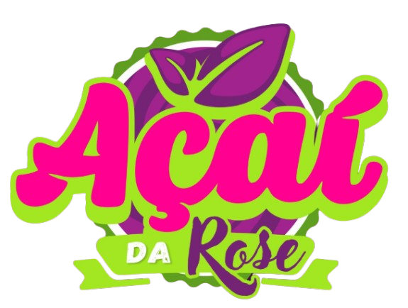

<div align="center">
  
  <h1>Açaí da Rose — Sistema Corporativo, PDV & Franqueadora</h1>
  <p><b>Ecossistema Multi-Tenant de Ponto de Venda (PDV), Cozinha (KDS), Ementa Digital QR Code e Gestão Corporativa de Franquias</b></p>
  <p>Portugal 🇵🇹</p>
</div>

---

## 🔒 Aviso de Propriedade & Confidencialidade

> [!IMPORTANT]
> **PROPRIEDADE EXCLUSIVA & PRIVADA**  
> Este software, respectivo código-fonte, arquitetura de dados e materiais visuais são propriedade estrita e confidencial de **Rose & Vavá Portugal Lda — Açaí da Rose**.  
> Qualquer reprodução, distribuição, engenharia reversa ou divulgação não autorizada deste repositório é estritamente proibida e sujeita às sanções da legislação europeia e portuguesa de proteção intelectual.

---

## 1. Visão Geral da Arquitetura

O sistema opera sob uma **arquitetura híbrida desacoplada**, otimizada para máxima velocidade, alta disponibilidade e segurança:

* **Frontend & Camada de Borda**: Hospedado na **Vercel Edge Network**, com renderização híbrida Next.js 15 (App Router).
* **Backend & Banco de Dados Relacional**: Hospedado em **Servidor Exclusivo de Produção**, operando **PostgreSQL 16 Alpine** com 21 tabelas relacionais, isolamento multi-tenant estrito e rotinas diárias de backup automatizado.
* **Mídias & Vídeos**: Entrega otimizada de Stories e cardápios em vídeo de alta resolução para telemóveis e Smart TVs.

```mermaid
flowchart TD
    subgraph "1. Clientes & Operação"
        ClientQR["📱 Ementa QR Code (/menu)"]
        Cashier["💻 PDV Balcão & Mesas (/pdv)"]
        Kitchen["🍳 KDS Cozinha (/admin/kds)"]
        Franchise["🏢 Painel Franqueadora & TI (/admin & /dev)"]
    end

    subgraph "2. Vercel Edge Network"
        App["⚡ Next.js 15 Standalone"]
        ClientQR --> App
        Cashier --> App
        Kitchen --> App
        Franchise --> App
    end

    subgraph "3. Servidor de Banco de Dados Dedicado"
        DB[("🗄️ PostgreSQL 16 (21 Tabelas Relacionais)")]
        Backups["⏰ Rotina de Backups Diários Automatizados"]
        DB --> Backups
    end

    App -->|DATABASE_URL Segura (SSL/TCP)| DB
```

---

## 2. Níveis de Acesso & Perfis Oficiais

1. **`SUPER_ADMIN` (Master TI — Central `/dev`)**:
   - Gestão de infraestrutura, integridade dos servidores, live error stream, emissão de tokens de hardware e modo *Impersonate*.
2. **`FRANCHISOR_ADMIN` (Franqueadora — Sede Matriz)**:
   - DRE consolidado da rede, royalties progressivos, fundo de marketing, triagem de cardápio (`franchise_requests`), abastecimento B2B e PDV Balcão.
3. **`TENANT_ADMIN` (Gerente de Loja Franqueada)**:
   - Gestão da unidade, equipe de operadores, estoque local, fecho cego de caixa e configuração de mesas.
4. **`CASHIER` (Operador de Caixa)**:
   - Montagem de taça em 3 passos, recebimentos (Numerário, MB WAY, TPA) e emissão de fatura simplificada com NIF.

---

## 3. Stack Tecnológica

* **Framework**: Next.js 15 (React 18, TypeScript 5.9 estrito)
* **Estilização**: Tailwind CSS com Design System Dark Mode Sóbrio
* **Estado Global**: Zustand
* **Banco de Dados**: PostgreSQL 16 Alpine (`pg` node-postgres pool com conexões seguras)
* **Notificações**: Web Audio API (Sintetizador de Chimes) + HTML5 Desktop Web Push Notifications

---

## 4. Configuração do Ambiente de Desenvolvimento

### Pré-requisitos
* Node.js `>= 20.x`
* npm `>= 10.x`

### Instalação
```bash
# 1. Clonar o repositório
git clone https://github.com/hljunqueira/acaidarose.git
cd acaidarose

# 2. Instalar dependências
npm install

# 3. Configurar variáveis de ambiente (nunca commitar .env.local)
cp .env.example .env.local

# 4. Iniciar servidor local
npm run dev
```

---

## 5. Scripts Disponíveis

| Comando | Descrição |
| :--- | :--- |
| `npm run dev` | Inicia o servidor Next.js em modo de desenvolvimento |
| `npm run build` | Compila o bundle otimizado de produção |
| `npm run deploy` | Executa deploy para o ambiente de produção |
| `npm run env:sync` | Sincroniza de forma segura as variáveis do `.env.local` |

---

<div align="center">
  <sub>© 2024–2026 Açaí da Rose Portugal Lda. Todos os direitos reservados.</sub>
</div>
