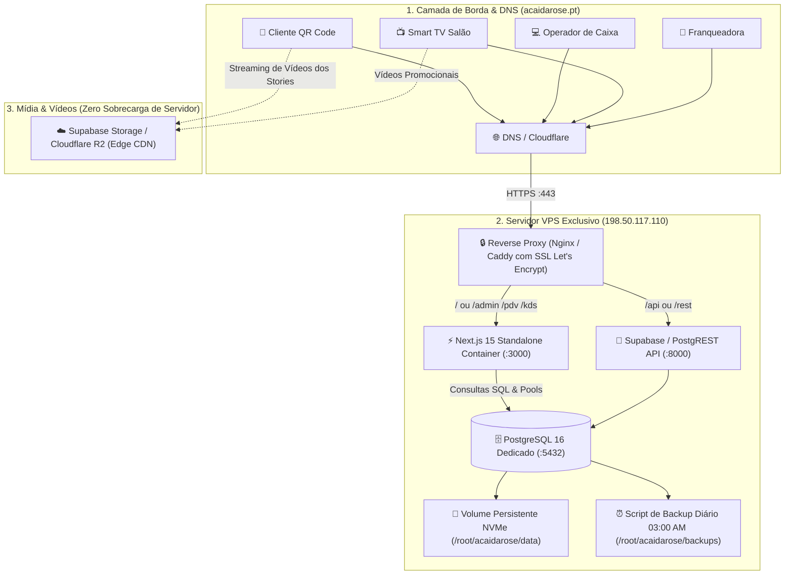

# Especificação Técnica: Arquitetura de Infraestrutura, Supabase, VPS e Domínios
**Açaí da Rose — Mapeamento Completo de Servidores, Topologia de Rede, DNS e Banco de Dados**

---

## 1. Topologia Geral da Infraestrutura

A infraestrutura do **Açaí da Rose** foi projetada para alta disponibilidade, isolamento multi-tenant seguro e custo operacional enxuto, operando 100% em nuvem com SSL automático e baixa latência para Portugal e Europa.



---

## 2. Especificações da VPS de Produção

| Dimensão | Especificação Técnica |
| :--- | :--- |
| **Endereço IP** | `198.50.117.110` |
| **Hostname Oficial** | `vps11110.panel.icontainer.site` |
| **Sistema Operacional** | **Ubuntu 26.04 LTS** (Kernel `7.0.0-30-generic`) |
| **Processamento (CPU)** | **4 vCPUs AMD EPYC** @ 2.60 GHz |
| **Memória RAM** | **6 GB RAM DDR4** (+ **2 GB Swapfile** ativado) |
| **Armazenamento** | **100 GB NVMe** de altíssima velocidade de I/O |
| **Fuso Horário Oficial** | `Europe/Lisbon` (WEST, +01:00) |
| **Portas Liberadas (UFW)** | `22` (SSH), `80` (HTTP), `443` (HTTPS), `2090` (Painel ICP) |
| **Proteção Ativa** | **Fail2ban** (bloqueio automático de força bruta no SSH) |
| **Acesso SSH** | Chave pública RSA configurada (acesso sem senha) |

---

## 3. Mapeamento de Domínios & DNS (Ambiente Vercel + VPS)

O sistema opera atualmente com o **Frontend e API Serverless na Vercel** (`https://acaidarose.vercel.app`) conectado diretamente ao **PostgreSQL 16 na VPS** (`198.50.117.110:5432`).

### A. Domínio Oficial Ativo:
* **URL de Produção**: `https://acaidarose.vercel.app`
* **Painel TI**: `https://acaidarose.vercel.app/dev`
* **Cardápio Digital**: `https://acaidarose.vercel.app/menu`

### B. Registros DNS para Domínio Personalizado Futuro (`acaidarose.pt`):
Para quando for ativar o domínio próprio no registrador/Cloudflare (consulte o [GUIA_DE_APONTAMENTOS_DNS_E_DOMINIOS.md](file:///c:/Users/Henrique%20-%20PC/Desktop/Projetos%20Dev/acaidarose/docs/GUIA_DE_APONTAMENTOS_DNS_E_DOMINIOS.md)):

| Tipo | Nome do Host | Destino / Valor | Finalidade |
| :--- | :--- | :--- | :--- |
| **A** | `@` (raiz) | `76.76.21.21` | Aponta para os servidores Anycast da Vercel |
| **CNAME** | `www` | `cname.vercel-dns.com` | Redirecionamento da Vercel |
| **CNAME** | `app` | `cname.vercel-dns.com` | Subdomínio dedicado do PDV/Admin na Vercel |
| **A** | `vps` (ou `db`) | `198.50.117.110` | Conexão com o banco de dados na VPS |

---

## 4. Estrutura de Containers Docker na VPS (`/root/acaidarose`)

### Árvore de Diretórios no Servidor:
```
/root/acaidarose/
├── docker-compose.yml          # Orquestrador da stack de produção
├── .env.production             # Segredos, chaves de API e URLs do banco
├── data/
│   └── postgresql/             # Volume físico persistente do banco no NVMe
├── backups/                    # Dumps diários compactados (.sql.gz)
└── config/
    └── nginx/                  # Configurações de SSL e Reverse Proxy
```

### Arquitetura do `docker-compose.yml`:
```yaml
version: '3.8'

services:
  # 1. Banco de Dados Relacional
  db:
    image: postgres:16-alpine
    container_name: acaidarose-db
    restart: always
    environment:
      POSTGRES_DB: acaidarose_prod
      POSTGRES_USER: acai_admin
      POSTGRES_PASSWORD: ${DB_PASSWORD}
    volumes:
      - ./data/postgresql:/var/lib/postgresql/data
      - ./backups:/backups
    ports:
      - "127.0.0.1:5432:5432"
    networks:
      - acaidarose-net

  # 2. Aplicação Next.js 15 (Frente de Loja, PDV, KDS e Admin)
  app:
    image: acaidarose-web:latest
    container_name: acaidarose-app
    restart: always
    environment:
      NODE_ENV: production
      DATABASE_URL: postgresql://acai_admin:${DB_PASSWORD}@db:5432/acaidarose_prod
      NEXT_PUBLIC_APP_URL: https://app.acaidarose.pt
    depends_on:
      - db
    ports:
      - "127.0.0.1:3000:3000"
    networks:
      - acaidarose-net

networks:
  acaidarose-net:
    driver: bridge
```

---

## 5. Arquitetura do Banco de Dados: PostgreSQL 16 Nativo (Alta Performance)

Optou-se pela arquitetura de **PostgreSQL 16 Puro (Alpine Docker)** com conexão direta e connection pooling pelo Next.js, em substituição à stack completa de microsserviços pesados do Supabase Self-Hosted.

### Benefícios da Decisão Técnica:
1. **Consumo de Memória Mínimo**: Utiliza apenas **~150 MB a 250 MB de RAM** (contra ~1.8 GB da stack completa com 10 microsserviços), deixando **mais de 5.5 GB de RAM livres** para o Next.js processar requisições em pico.
2. **Consultas SQL de Baixa Latência**: Conexão direta via pool nativo (`pg` / Prisma / Drizzle) sem camadas intermediárias de proxy REST.
3. **Poder de `JSONB` Nativo**: Armazenamento e indexação dos itens dos copos de açaí com total flexibilidade e velocidade.
4. **Interface Visual de Gestão**: Suporte nativo ao **Prisma Studio**, **DBeaver** ou **pgAdmin** para auditoria e gestão da base sem overhead de containers adicionais.
5. **Mídia e Mídias em Vídeo (Edge Storage)**:
   - Vídeos dos Stories (3–5s, ~1.5 MB) e fotos servidos diretamente via **Cloudflare R2 / S3 / Supabase Storage com Edge CDN**, garantindo **zero consumo de banda e zero carga na VPS**.

---

## 6. Política de Backup e Continuidade de Negócio

* **Frequência**: Diária às **03:00 AM** (horário de Lisboa).
* **Comando de Execução Automática (Cron Job)**:
  ```bash
  0 3 * * * docker exec acaidarose-db pg_dump -U acai_admin acaidarose_prod | gzip > /root/acaidarose/backups/backup_$(date +\%Y\%m\%d_\%H\%M\%S).sql.gz
  ```
* **Retenção**: Histórico dos últimos **30 dias** mantido em disco NVMe com rotação automática de arquivos antigos.
* **Tempo de Restauração (RTO)**: Menos de **5 minutos** em caso de desastre.
