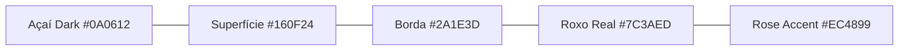

# Manual de Identidade Visual, Branding Kit & Design System
**Açaí da Rose — Guia Oficial de Cores, Tipografia, Aplicações de Logo e Componentes UI**

---

## 1. Visão Geral da Identidade da Marca

A marca **Açaí da Rose** transmite sofisticação, sabor autêntico e excelência gastronômica. A sua identidade visual une a nobreza e intensidade do **Açaí Roxo Puro** à elegância e frescura do **Tom Rose**, construída sob uma estética **dark mode minimalista, limpa e premium**, sem elementos visuais infantis ou excessivos.

---

## 2. Paleta Cromática Oficial (Tokens de Cores)



### A. Cores Institucionais & Interface (Dark Mode Profundo)
| Nome do Token | Hexadecimal | RGB | Aplicação Primária |
| :--- | :--- | :--- | :--- |
| **`bg-canvas`** | `#0A0612` | `rgb(10, 6, 18)` | Fundo base global de toda a aplicação (telas, PDV, KDS). |
| **`bg-surface`** | `#160F24` | `rgb(22, 15, 36)` | Superfície de cards, modais, painéis e gavetas. |
| **`border-subtle`**| `#2A1E3D` | `rgb(42, 30, 61)` | Bordas e divisores sutis de 1px. |
| **`brand-primary`**| `#7C3AED` | `rgb(124, 58, 237)` | Botões primários, links ativos, seleção e estados de foco. |
| **`brand-rose`** | `#EC4899` | `rgb(236, 72, 153)` | Acentos secundários, badges da marca e detalhes da Rose. |
| **`brand-glow`** | `#8B5CF6` | `rgb(139, 92, 246)` | Efeito hover suave e realce de cards interativos. |

---

### B. Cores Semânticas de Status & Feedback
| Status / Função | Hexadecimal | RGB | Aplicação no Sistema |
| :--- | :--- | :--- | :--- |
| **`status-success`** *(Pago / Pronto)* | `#10B981` | `rgb(16, 185, 129)` | Pedido pago, item pronto na cozinha, turno aberto com sucesso. |
| **`status-warning`** *(Pendente / Atenção)* | `#F59E0B` | `rgb(245, 158, 11)` | Pedido aguardando preparo, solicitação pendente na Franqueadora. |
| **`status-danger`** *(Cancelado / Erro)* | `#EF4444` | `rgb(239, 68, 68)` | Erro de validação, cancelamento de pedido, sangria de caixa. |
| **`status-info`** *(Salão / Mesas)* | `#3B82F6` | `rgb(59, 130, 246)` | Mesa ocupada, chamado de garçom em atendimento. |

---

### C. Escala de Textos & Contraste
* **Texto Primário (High Emphasis)**: `#FFFFFF` (100% Branco) — Títulos, totais em Euro e botões primários.
* **Texto Secundário (Medium Emphasis)**: `#D1D5DB` (`gray-300`) — Rótulos, descrições e nomes de produtos.
* **Texto Terciário (Muted / Placeholder)**: `#9CA3AF` (`gray-400`) — Dicas, legendas e placeholders de input.

---

## 3. Tipografia Oficial

A tipografia do sistema utiliza fontes modernas do Google Fonts com foco em **máxima legibilidade em telas táteis de balcão e telemóveis**:

```
Font Family Primária: 'Inter', -apple-system, BlinkMacSystemFont, 'Segoe UI', Roboto, sans-serif;
Font Family Numérica / Moeda: 'JetBrains Mono', 'Roboto Mono', monospace (tabular-nums);
```

### Hierarquia Tipográfica:
* **H1 / Display (Títulos de Página)**: `text-xl` / `text-2xl`, `font-bold` (700), `tracking-tight` (-0.025em).
* **H2 / Subtítulos de Card**: `text-sm` / `text-base`, `font-semibold` (600).
* **Body / Textos Gerais**: `text-xs` / `text-sm`, `font-normal` (400), `leading-relaxed`.
* **Microcopy / Badges / Tags**: `text-[11px]` / `text-[10px]`, `font-semibold` (600), `uppercase`, `tracking-wider`.
* **Valores em Euro (€)**: `font-mono`, `font-bold`, `tabular-nums` (ex: `8,50 €`).

---

## 4. Diretrizes de Aplicação da Logo

A logo oficial do **Açaí da Rose** (`/public/logo.png`) é o elemento central de reconhecimento da marca:

```
    ┌─────────────────────────────────────────────────────────┐
    │  [ ÁREA DE PROTEÇÃO / RESPIRO MÍNIMO: 16px ]           │
    │                                                         │
    │         🌺 A Ç A Í   D A   R O S E                      │
    │                                                         │
    └─────────────────────────────────────────────────────────┘
```

### A. Versões Oficiais
1. **Versão Completa Horizontal (Principal)**:
   - Utilizada no Topbar do sistema, cabeçalhos de relatórios A4 e na Landing Page.
   - Altura padrão na Topbar: `36px` a `40px`.
2. **Versão Símbolo / Ícone (Favicon & Sidebar Recolhida)**:
   - Utilizada quando a Sidebar está no modo compacto (64px), no Favicon (`favicon.ico`) e no ecrã de telemóvel.
3. **Versão Monocromática em Preto e Branco (Impressão Térmica)**:
   - Utilizada exclusivamente para o cabeçalho do talão de Fatura Simplificada nas impressoras ESC/POS (58mm e 80mm).

### B. O que NUNCA fazer com a Logo:
* ❌ Não distorcer, achatar ou esticar a proporção da imagem;
* ❌ Não adicionar sombras coloridas pesadas (*drop-shadow neon*);
* ❌ Não alterar as cores dos elementos da logo;
* ❌ Não aplicar a logo sobre fundos fotográficos poluídos sem máscara escura (`bg-black/60`).

---

## 5. Padrões de Componentes UI (Design System)

### A. Botões (Button Styles)
* **Botão Primário (Ação Principal)**:
  - `bg-purple-600 hover:bg-purple-700 text-white font-medium text-xs px-4 h-9 rounded-lg transition-all`
* **Botão Secundário / Neutro**:
  - `bg-[#2A1E3D] hover:bg-[#382852] text-gray-200 font-medium text-xs px-3.5 h-9 rounded-lg transition-all`
* **Botão Destrutivo / Danger**:
  - `bg-red-900/80 hover:bg-red-800 text-red-100 border border-red-700/50 font-medium text-xs px-3.5 h-9 rounded-lg`

### B. Campos de Entrada (Inputs & Selects)
* **Input Padrão**:
  - `bg-[#0A0612] border border-[#2A1E3D] text-white text-xs rounded-lg h-9 px-3 focus:outline-none focus:border-purple-500 transition`

### C. Modais e Diálogos
* **Backdrop**: `bg-black/75 backdrop-blur-sm fixed inset-0 z-50`
* **Superfície do Modal**: `bg-[#160F24] border border-[#2A1E3D] rounded-2xl shadow-2xl p-6 text-white max-w-lg w-full`

### D. Toasts de Notificação
* **Toast Escuro Minimalista**:
  - `bg-[#160F24] border border-[#2A1E3D] text-white text-xs shadow-2xl rounded-xl py-3 px-4`
