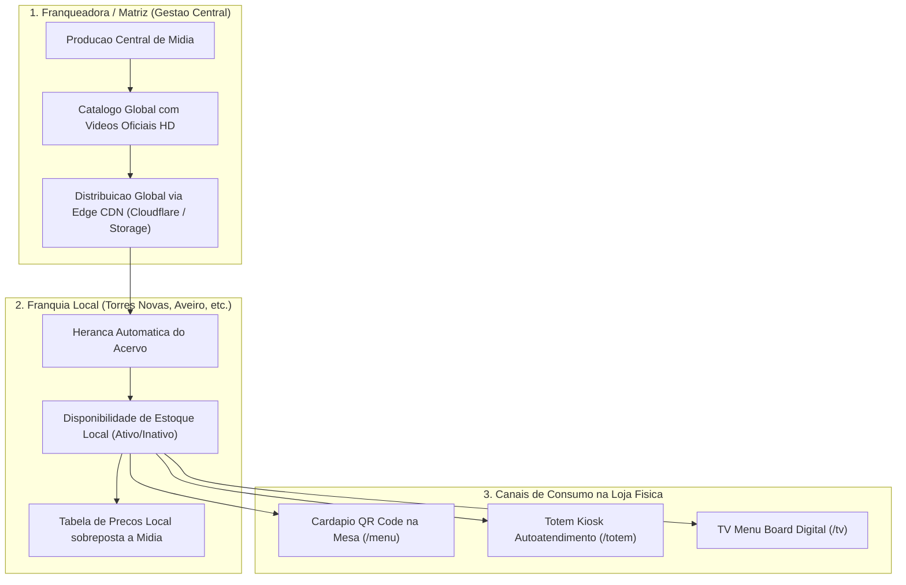

# Especificação Técnica: Menus em Vídeo & Ecossistema de Mídia para Franquias
**Açaí da Rose — Distribuição Centralizada de Mídia, CDN Edge e Governança de Rede**

---

## 1. Visão Geral

O módulo de Menus em Vídeo substitui imagens estáticas tradicionais por **microvídeos em loop de 3 a 5 segundos**, destacando a apresentação dos copos, bases e toppings com fluidez e apelo visual.

### Objetivos Principais:
1. **Impacto Visual e Conversão**: Redução do tempo de decisão e aumento do ticket médio através da visualização em movimento dos produtos.
2. **Distribuição Multi-canal**: A mesma base de mídias alimenta simultaneamente o cardápio mobile (QR Code), totens de autoatendimento e monitores de salão.
3. **Escalabilidade em Rede**: Controle de acervo centralizado pela Matriz com controle de disponibilidade local por cada franquia.

---

## 2. Modelo de Governança (Matriz vs. Franquias)



### Regras de Negócio:
* **Padronização Visual**: A Franqueadora cadastra os vídeos oficiais em alta definição. As franquias herdam o acervo automaticamente, sem custos de produção individual de mídia.
* **Sobrescrita Local Segura**: Caso um insumo esteja temporariamente em falta numa unidade, a franquia desativa o item em 1 clique sem afetar o catálogo das demais lojas.
* **Preço Dinâmico**: O preço não é fixado no arquivo de vídeo; é renderizado dinamicamente sobre o layout conforme a tabela de preços vigente da respectiva loja.

---

## 3. Arquitetura de Mídia e Otimização de Rede

Para garantir velocidade de carregamento instantânea e zero consumo de banda na VPS:

| Dimensão | Especificação Técnica | Justificativa |
| :--- | :--- | :--- |
| **Formato de Vídeo** | `MP4 (H.264 / AAC)` + fallback `WebM` | Compatibilidade nativa com 100% dos dispositivos iOS, Android e Smart TVs. |
| **Duração & Peso** | 3 a 5 segundos por loop, máximo de **1.5 MB a 2.0 MB** | Carregamento imediato mesmo em conexões móveis 4G. |
| **Armazenamento & CDN** | **Cloudflare R2 / S3 / Supabase Storage com Edge CDN** | Distribuição de conteúdo na borda com latência inferior a 30ms em Portugal. |
| **Estratégia de Carga** | `Poster Image (WebP)` + `IntersectionObserver` | O vídeo só inicia o download quando visível no viewport do cliente. |
| **Idioma Padrão** | `Português (PT)` | Idioma nativo das operações em Portugal. |

---

## 4. Aplicação nos Ambientes Físicos da Loja

### A. Mesas & Esplanadas (Cardápio QR Code Mobile)
* Rota: `/menu?loja={slug}&mesa={numero}`
* Exibe carrossel superior de destaques em vídeo.
* Ao selecionar um produto, abre visualizador vertical com botão de ação direta: `Montar Copo`.

### B. Totens de Autoatendimento (Kiosk no Balcão)
* Rota: `/totem?loja={slug}`
* Interface tátil vertical com modo de descanso cinematográfico em caso de inatividade por mais de 30 segundos.

### C. TV Menu Board Digital (Painéis de Parede)
* Rota: `/tv?loja={slug}`
* Execução em navegadores nativos de Smart TVs com divisão de tela (60% preços / 40% vídeo promocional) e cross-fade suave.

---

## 5. Modelagem de Dados no PostgreSQL

```sql
CREATE TABLE IF NOT EXISTS store_stories (
    id UUID PRIMARY KEY DEFAULT uuid_generate_v4(),
    tenant_id UUID REFERENCES tenants(id) ON DELETE CASCADE, -- NULL = Midia Global Matriz
    title VARCHAR(100) NOT NULL,
    video_url TEXT NOT NULL,
    thumbnail_url TEXT NOT NULL,
    linked_product_id UUID,
    badge_text VARCHAR(50),
    display_order INTEGER DEFAULT 0,
    active BOOLEAN DEFAULT TRUE,
    created_at TIMESTAMP WITH TIME ZONE DEFAULT timezone('utc'::text, now()) NOT NULL,
    updated_at TIMESTAMP WITH TIME ZONE DEFAULT timezone('utc'::text, now()) NOT NULL
);

CREATE INDEX IF NOT EXISTS idx_stories_tenant ON store_stories(tenant_id, active);
```
