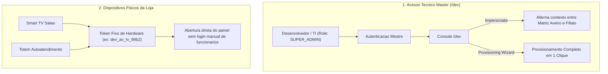

# Especificação Técnica: Central Master de TI & Provisionamento Automático de Franquias
**Açaí da Rose — Console de Administração Técnica, Impersonate de Lojas, Hardware Tokens e Setup em 1 Clique**

---

## 1. Visão Geral

A **Central Master de TI (`/dev` ou `/admin/master`)** é o console exclusivo para o desenvolvedor e para a equipe técnica da rede Açaí da Rose. Ela fornece visibilidade completa de todas as unidades, ferramentas de suporte remoto e automação de provisionamento de novas franquias.

### Objetivos:
1. **Suporte Remoto Instantâneo**: Alternância de contexto para qualquer loja sem necessidade de credenciais de gerentes (*Modo Impersonate*).
2. **Provisionamento Automático de Franquias**: Criação de novas filiais com clonagem do catálogo canônico da Matriz Aveiro, geração de tokens e QR Codes em lote em 1 clique.
3. **Autenticação Descomplicada de Hardware**: Emissão de tokens fixos para Smart TVs de salão e totens touch.
4. **Telemetria do Banco de Dados**: Monitoramento de conexões ativas no PostgreSQL, integridade do NVMe e acionamento manual de backups.

---

## 2. Arquitetura de Acesso e Governança



---

## 3. Assistente de Provisionamento Automático de Franquias (`CreateStoreDialog`)

Ao cadastrar uma nova unidade no painel, o assistente executa as seguintes etapas automatizadas em uma única transação atômica no banco de dados:

```
+-------------------------------------------------------------------------+
| PROVISIONAMENTO DE NOVA FRANQUIA                                        |
+-------------------------------------------------------------------------+
| Identificacao:                                                          |
|   Nome da Loja: [ Açaí da Rose — Cascais                              ] |
|   Slug Gerado:  cascais (acesso: acaidarose.pt/menu?loja=cascais)      |
|   NIF Fiscal:   [ 500 999 888       ]  Telemovel MB WAY: [ 912 345 678] |
|   Morada:       [ Avenida Marginal, 100 - Cascais                     ] |
|                                                                         |
| Configuracoes de Rede:                                                  |
|   [X] Clonar catalogo canônico da Matriz Aveiro (Taças, Bases e Toppings) |
|   Taxa de Royalties (%): [ 5.00 ]     Fundo de Marketing (%): [ 1.00 ]  |
|                                                                         |
| Gerente & Salão Inicial:                                                |
|   Responsável:  [ Carlos Silva      ]  Email: [ cascais@acaidarose.pt ] |
|   Mesas Iniciais: [ 8 ] mesas (gera QR Codes 1 a 8 em lote)             |
|                                                                         |
| [ Cancelar ]                                 [ Provisionar Franquia ]   |
+-------------------------------------------------------------------------+
```

### Automações Executadas no Banco de Dados:
1. **Criação do Tenant**: Insere o registro na tabela `tenants` com slug único e percentual de royalties.
2. **Herança do Catálogo**: Vincula todos os recipientes, bases e toppings da Matriz Aveiro à nova loja.
3. **Criação do Utilizador Gerente**: Insere na tabela `users` com role `TENANT_ADMIN` e senha inicial provisória.
4. **Setup das Mesas**: Insere as mesas (1 a N) na tabela `restaurant_tables`.
5. **Geração dos Tokens de Hardware**: Insere os tokens na tabela `store_devices` para a Smart TV de chamadas e o totem da loja.

---

## 4. Modal de Conclusão / Onboarding do Franqueado

Após o provisionamento, o sistema exibe o resumo pronto para ser entregue ao franqueado:

```
+-------------------------------------------------------------------------+
| FRANQUIA PROVISIONADA COM SUCESSO                                       |
+-------------------------------------------------------------------------+
| Unidade: Açaí da Rose — Cascais                                         |
|                                                                         |
| Links Oficiais de Acesso:                                               |
|   Cardapio Digital:  https://acaidarose.pt/menu?loja=cascais            |
|   Smart TV Chamada:  https://app.acaidarose.pt/chamada?loja=cascais     |
|   Acesso PDV Balcao: https://app.acaidarose.pt/pdv?loja=cascais         |
|                                                                         |
| Credenciais do Gerente:                                                 |
|   Utilizador: cascais@acaidarose.pt                                     |
|   Palavra-passe: AcaiCascais#2026                                       |
|                                                                         |
| [ Copiar Kit Boas-Vindas ]                 [ Descarregar QR Codes PDF ] |
+-------------------------------------------------------------------------+
```

---

## 5. Hub de Links Diretos no Console Master (`/dev`)

| Loja / Filial | Slug | PDV Balcão | KDS Cozinha | Cardápio QR | TV Chamada | Status |
| :--- | :--- | :---: | :---: | :---: | :---: | :---: |
| **Aveiro (Matriz)** | `aveiro` | `[Abrir]` | `[Abrir]` | `[Abrir]` | `[Abrir]` | Ativo |
| **Torres Novas (Filial)** | `torres-novas` | `[Abrir]` | `[Abrir]` | `[Abrir]` | `[Abrir]` | Ativo |
