# Gestão de Estoque & Supply Chain para Franquias: Modelo Híbrido (Human-in-the-Loop)
**Açaí da Rose — Arquitetura de Estoque Prática, Alertas Inteligentes e Controle Humano**

---

## 1. Visão Geral & Filosofia Operacional

Diferente de sistemas puramente teóricos que tentam automatizar tudo e travam a operação da loja, o **Açaí da Rose** adota o **Modelo Híbrido (Assistido por Humano)**. 

### O Princípio Fundamental:
> *"O sistema calcula, projeta e alerta; o operador humano confere, valida e decide."*

### Por que evitar a automação 100% "cega":
1. **Variação natural de porções**: Na ficha técnica constam 30g de Nutella ou fruta, mas na prática um atendente serve 35g e outro 25g. Em 100 copos a matemática do sistema diverge do físico.
2. **Perdas e perecíveis**: Frutas oxidam/estragam, sobra calda nas bisnagas e açaí no fundo do balde.
3. **Prevenção de falsa ruptura**: O sistema jamais deve travar vendas automaticamente no cardápio online/QR Code sem confirmação visual do atendente (evitando perda de vendas caso haja estoque na câmara fria ainda não registrado).

---

## 2. Fluxo Operacional Diário (3 Etapas)

```mermaid
flowchart TD
    subgraph "1. Operação Durante o Turno"
        Sale["Vendas no PDV e QR Code"] --> Calc["Sistema calcula consumo estimado"]
        Calc --> Alert["⚠️ Alerta Amarelo: 'Estoque estimado baixo'"]
        Alert --> HumanCheck["👁️ Atendente olha a bancada"]
        HumanCheck -->|Acabou| PauseMenu["⏸️ Pausar item no Cardápio (1 Clique)"]
        HumanCheck -->|Ainda tem| KeepSelling["✅ Manter item ativo"]
    end

    subgraph "2. Troca de Turno / Fechamento de Caixa"
        CloseShift["Fechamento de Caixa"] --> Checklist["📋 Checklist Rápido de 2 Minutos"]
        Checklist --> Count["Contagem dos 5 itens críticos (Baldes, Nutella, Frutas, Copos)"]
        Count --> Adjust["Ajuste de Saldo & Cálculo de Quebra Real"]
    end

    subgraph "3. Abastecimento Franqueadora -> Loja"
        HQShip["🚚 Matriz envia insumos"] --> StoreReceive["📦 Conferência Física na Loja"]
        StoreReceive --> Confirm["👍 Gerente clica em 'Confirmar Recebimento'"]
        Confirm --> StockIn["Entrada no Estoque Oficial da Loja"]
    end
```



---

## 3. Os 3 Pilares do Modelo Híbrido

### A. Alertas Inteligentes (Sem Travas Automáticas)
* O sistema monitora a saída teórica e gera alertas visuais no painel do caixa / KDS:
  - 🟢 **Normal**: Estoque suficiente.
  - 🟡 **Atenção (< 20% do estoque mínimo)**: *"Atenção: Morango com estoque estimado baixo. Favor conferir no balcão."*
  - 🔴 **Crítico**: Permite ao atendente pausar o item do cardápio em 1 clique com motivo: *"Esgotado temporariamente"*.

### B. Checklist Rápido de Fechamento de Caixa (2 Minutos)
* Ao fechar o turno/caixa no PDV, antes do relatório de valores (MB Way, Dinheiro, Cartão), o operador passa por uma tela simples de conferência dos **itens críticos**:
  1. Baldes de Açaí (Cheios e Abertos)
  2. Potes/Baldes de Nutella
  3. Estoque de Frutas (Morango / Banana)
  4. Caixas de Copos (300ml, 500ml, 700ml)
* O sistema compara o valor teórico com o informado pelo operador e gera o **Índice de Quebra / Desvio**, identificando excesso de porção ou desperdício sem burocracia.

### C. Portal de Abastecimento B2B & Comparador de Preços (Vantagens Franqueadora)
Para incentivar a compra centralizada na Matriz e garantir a qualidade dos insumos sem imposição burocrática, o painel do franqueado conta com um **Comparador de Economia em Tempo Real**:

```
+-------------------------------------------------------------------------+
| 🛒 CENTRAL DE ABASTECIMENTO & VANTAGENS DO FRANQUEADO                   |
| 💡 Economia acumulada da sua loja comprando pela Matriz: € 1.240,00     |
+-------------------------------------------------------------------------+
| INSUMO HOMOLOGADO        | PREÇO MERCADO EXTERNO | PREÇO MATRIZ | ECONOMIA DIRETA |
|--------------------------|-----------------------|--------------|-----------------|
| 🍫 Balde Nutella 3kg     |        € 24.50        |   € 22.50    |  🟢 -€ 2.00     |
| 🍨 Açaí Premium (Cx 10kg)|        € 38.00        |   € 32.00    |  🟢 -€ 6.00     |
| 📦 Copos 500ml (Cx 500un)|        € 45.00        |   € 39.00    |  🟢 -€ 6.00     |
| 🥛 Leite Condensado 5kg  |        € 18.90        |   € 16.50    |  🟢 -€ 2.40     |
| 🌾 Granola Tradicional   |        € 14.50        |   € 12.00    |  🟢 -€ 2.50     |
+-------------------------------------------------------------------------+
| [ 🛒 Montar Pedido de Reposição ]            [ 📊 Relatório de Economia ]
+-------------------------------------------------------------------------+
```

* **Vantagens para a Rede**:
  - **Fidelização Natural**: O franqueado compra na Matriz porque o preço é comprovadamente mais vantajoso que distribuidores locais (Makro, Recheio, etc.).
  - **Padronização Imutável**: Garante 100% de consistência de sabor e embalagens em todas as lojas da rede.
  - **Poder de Escala da Matriz**: A Franqueadora ganha margem na compra direta de indústrias e produtores por volume.
* **Fluxo de Pedido**:
  1. Franqueado seleciona as quantidades e clica em **"Enviar Pedido à Matriz"**.
  2. Matriz aprova e gera a **Guia de Expedição**.
  3. Ao chegar na loja física, o gerente confere os volumes e clica em **"Confirmar Recebimento"**, abastecendo o estoque local automaticamente.

---

## 4. Modelagem de Dados no PostgreSQL

```sql
-- 1. Catálogo de Insumos da Rede com Tabela Comparativa de Mercado
CREATE TABLE IF NOT EXISTS inventory_items (
    id UUID PRIMARY KEY DEFAULT uuid_generate_v4(),
    name VARCHAR(150) NOT NULL, -- Ex: "Açaí Tradicional (Balde 10kg)", "Nutella (Balde 3kg)", "Copo 500ml"
    unit VARCHAR(20) NOT NULL, -- 'UN', 'KG', 'L', 'CX'
    category VARCHAR(50) NOT NULL, -- 'BASE', 'TOPPING', 'EMBALAGEM', 'DESCARTAVEL'
    market_benchmark_price NUMERIC(10, 2) NOT NULL DEFAULT 0.00, -- Preço médio de mercado externo
    franchise_supply_price NUMERIC(10, 2) NOT NULL DEFAULT 0.00, -- Preço exclusivo vendido pela Matriz
    is_critical_checklist BOOLEAN DEFAULT FALSE, -- Aparece no checklist de fechamento
    created_at TIMESTAMP WITH TIME ZONE DEFAULT timezone('utc'::text, now()) NOT NULL
);

-- 2. Saldo de Estoque por Loja
CREATE TABLE IF NOT EXISTS store_inventory (
    id UUID PRIMARY KEY DEFAULT uuid_generate_v4(),
    tenant_id UUID NOT NULL REFERENCES tenants(id) ON DELETE CASCADE,
    item_id UUID NOT NULL REFERENCES inventory_items(id) ON DELETE CASCADE,
    current_quantity NUMERIC(10, 2) NOT NULL DEFAULT 0.00,
    min_alert_quantity NUMERIC(10, 2) NOT NULL DEFAULT 0.00,
    last_counted_at TIMESTAMP WITH TIME ZONE,
    last_counted_by UUID REFERENCES users(id),
    updated_at TIMESTAMP WITH TIME ZONE DEFAULT timezone('utc'::text, now()) NOT NULL,
    UNIQUE (tenant_id, item_id)
);

-- 3. Pedidos de Abastecimento Franqueado -> Matriz (Supply Orders)
CREATE TABLE IF NOT EXISTS supply_orders (
    id UUID PRIMARY KEY DEFAULT uuid_generate_v4(),
    tenant_id UUID NOT NULL REFERENCES tenants(id) ON DELETE CASCADE,
    order_number SERIAL,
    status VARCHAR(50) DEFAULT 'PENDING' NOT NULL, -- 'PENDING', 'SHIPPED', 'DELIVERED', 'CANCELLED'
    total_amount NUMERIC(10, 2) NOT NULL DEFAULT 0.00,
    total_savings NUMERIC(10, 2) NOT NULL DEFAULT 0.00, -- Economia gerada vs mercado externo
    items_json JSONB NOT NULL DEFAULT '[]'::jsonb,
    shipped_at TIMESTAMP WITH TIME ZONE,
    received_at TIMESTAMP WITH TIME ZONE,
    received_by UUID REFERENCES users(id),
    created_at TIMESTAMP WITH TIME ZONE DEFAULT timezone('utc'::text, now()) NOT NULL
);

-- 4. Histórico de Ajustes & Checklists de Fechamento (Auditoria)
CREATE TABLE IF NOT EXISTS inventory_audits (
    id UUID PRIMARY KEY DEFAULT uuid_generate_v4(),
    tenant_id UUID NOT NULL REFERENCES tenants(id) ON DELETE CASCADE,
    cashier_shift_id UUID, -- Vínculo com o turno do caixa fechado
    item_id UUID NOT NULL REFERENCES inventory_items(id) ON DELETE CASCADE,
    theoretical_quantity NUMERIC(10, 2) NOT NULL,
    counted_quantity NUMERIC(10, 2) NOT NULL,
    difference NUMERIC(10, 2) NOT NULL, -- (counted - theoretical)
    reason VARCHAR(100), -- 'CHECKLIST_FECHAMENTO', 'QUEBRA_DESCARTE', 'ENTRADA_MATRIZ'
    operator_id UUID REFERENCES users(id),
    created_at TIMESTAMP WITH TIME ZONE DEFAULT timezone('utc'::text, now()) NOT NULL
);
```
