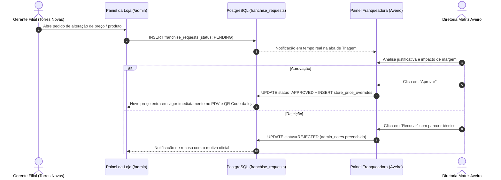

# Governança de Cardápio & Workflow de Solicitações de Franquias
**Açaí da Rose — Regras de Aprovação de Preços, Produtos e Autonomia de Lojas**

---

## 1. Princípio Fundamental de Marca & Franquia

Para preservar a coerência de marca, a qualidade do produto e o posicionamento de mercado da rede **Açaí da Rose** em todo o território português:

1. **Apenas a Sede Franqueadora & Matriz Aveiro pode criar, alterar receitas ou precificar produtos oficialmente**.
2. **Nenhuma loja franqueada (ex: Torres Novas) pode alterar preços ou introduzir novos itens diretamente no PDV ou no QR Code de mesa sem aprovação formal prévia**.
3. **Qualquer adaptação de cardápio exige a abertura de um Pedido de Solicitação (`franchise_requests`)**, que é analisado pela equipe da Matriz Aveiro antes de entrar em vigor.

---

## 2. Fluxo Operacional de Solicitação e Aprovação



---

## 3. Tipos de Solicitação Disponíveis no Painel da Filial

1. **Alteração de Preço de Venda (`PRICE_CHANGE`)**:
   - *Exemplo*: A filial de Torres Novas solicita ajustar a Taça 500g de **8,50€** para **8,90€** devido ao custo locatício do shopping.
   - *Campos*: Produto selecionado, preço atual (fixo), preço sugerido e justificativa de mercado.
2. **Indisponibilidade / Rotura de Ingrediente (`ITEM_AVAILABILITY`)**:
   - *Exemplo*: Filial avisa que o morango fresco da região acabou no dia e pausa temporariamente o topping até à reposição da manhã seguinte.
3. **Proposta de Novo Item Regional (`NEW_ITEM_PROPOSAL`)**:
   - *Exemplo*: Filial propõe inclusão de um doce típico da região ou novo sabor de sorbet para avaliação do chef executivo da Matriz.

---

## 4. Estrutura de Banco de Dados (`franchise_requests`)

```sql
CREATE TABLE IF NOT EXISTS franchise_requests (
    id UUID PRIMARY KEY DEFAULT gen_random_uuid(),
    tenant_id UUID NOT NULL REFERENCES tenants(id) ON DELETE CASCADE,
    request_type VARCHAR(50) DEFAULT 'PRICE_CHANGE' NOT NULL,
    product_id VARCHAR(100) NOT NULL,
    product_name VARCHAR(150) NOT NULL,
    requested_price NUMERIC(10, 2),
    current_price NUMERIC(10, 2),
    reason TEXT NOT NULL,
    status VARCHAR(50) DEFAULT 'PENDING' NOT NULL, -- PENDING, APPROVED, REJECTED
    admin_notes TEXT, -- Parecer emitido pela Matriz Aveiro
    reviewed_by UUID REFERENCES users(id),
    reviewed_at TIMESTAMP WITH TIME ZONE,
    created_at TIMESTAMP WITH TIME ZONE DEFAULT timezone('utc'::text, now()) NOT NULL,
    CONSTRAINT chk_franchise_request_status CHECK (status IN ('PENDING', 'APPROVED', 'REJECTED')),
    CONSTRAINT chk_franchise_request_type CHECK (request_type IN ('PRICE_CHANGE', 'ITEM_AVAILABILITY', 'NEW_ITEM_PROPOSAL'))
);
```

---

## 5. Aplicação Automática após Aprovação

Ao clicar em **"Aprovar"** no Painel da Franqueadora:
1. O backend insere ou atualiza o registro na tabela `store_price_overrides`:
   ```sql
   INSERT INTO store_price_overrides (tenant_id, product_id, custom_price)
   VALUES (req.tenant_id, req.product_id, req.requested_price)
   ON CONFLICT (tenant_id, product_id) DO UPDATE SET custom_price = EXCLUDED.custom_price;
   ```
2. O PDV Balcão da loja e os QR Codes de mesa passam a calcular a venda com o novo preço aprovado automaticamente, sem necessidade de reiniciar a aplicação.
