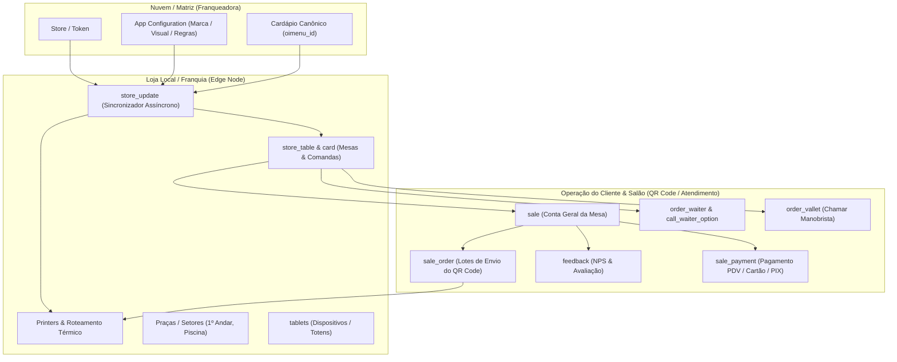

# Mapeamento Técnico e Arquitetural: Banco OiMenu / Abrahão
**Análise de Engenharia Reversa do Dump de Produção (`oimenu_bkp.sql`)**

---

## 1. Visão Geral & Arquitetura do Sistema

O sistema **OiMenu (Abrahão)** é uma plataforma híbrida desenhada para **autoatendimento via QR Code / Tablets de Mesa, Totens (Kiosk), Comandas Digitais e Gestão de Salão / KDS / Impressão Térmica**, operando em sincronia entre uma **Cloud Central (Matriz/Franqueadora)** e um **Servidor Local / Edge (Loja Física / Franquia)**.

O banco de dados relacional (MySQL/InnoDB com Sequelize ORM) conta com **45 tabelas** estruturadas em 7 grandes domínios funcionais:



---

## 2. Mapeamento Multiloja (Franqueadora vs. Lojas Franqueadas)

O modelo do OiMenu / Abrahão foi construído especificamente para redes e franquias, resolvendo o controle centralizado e a autonomia de cada unidade:

### 2.1. Identificação e Licenciamento da Unidade (`store`)
* **`id` / `token`**: Identificador único e chave de autenticação da filial na API OiMenu.
* **`sales_closed_at` / `database_flushed_at`**: Controle de abertura, virada e fechamento de turno diário da loja.
* **`next_sequential`**: Sequencial de pedidos local resiliente a quedas de conexão.

### 2.2. Governança da Marca e Regras Visuais (`app_configuration`)
* **Identidade Visual por Loja/Rede**: `store_name`, `theme` (`'dark'` / `'light'`), `color` (ex: `#e72229`), `image` (logomarca da franquia).
* **Multilíngue**: `languages` (ex: `["pt-BR"]`, `["en"]`, `["es"]`).
* **Status Financeiro / Bloqueio**: `store_status_id`, `is_overdue` (bloqueio automático de lojas inadimplentes).
* **Modo de Operação**: `order_mode` (Cardápio Informativo vs Pedido na Mesa vs Totem Autoatendimento).

### 2.3. Herança de Cardápio Matriz vs. Filial (`is_invisible_by_matriz_first_load`)
Nas tabelas de catálogo (`category`, `product`, `product_attribute`, `product_attribute_option`, `product_item`):
* **`oimenu_id`**: Chave canônica do item cadastrado na Matriz/Franqueadora.
* **`remote_code` / `codigo_externo`**: Mapeamento do código do produto no ERP local da loja.
* **`is_invisible_by_matriz_first_load`**: Quando a Franqueadora publica um produto novo na rede, a loja pode recebê-lo oculto por padrão até cadastrar custo/estoque local.
* **`is_invisible_by_api` / `visible`**: Controle de disponibilidade regional.
* **`is_erp_sync_product_enabled`**: Permite sincronizar preços e estoque automaticamente com o ERP de cada loja.

### 2.4. Motor de Sincronismo em Tempo Real (`store_update`)
A filial monitora permanentemente atualizações da Matriz divididas por tópicos:
1. `cardapio` (Preços, fotos, descrições)
2. `categorias` (Estrutura do menu)
3. `colaboradores` (Usuários e permissões)
4. `configuracoes` & `configuracoes-gerais` (Parâmetros operacionais)
5. `desenvolvedores` (Tokens e integrações de API)
6. `impressoras` (Mapeamento de impressão térmica)
7. `pedidos` (Status e conciliação)
8. `tablets` (Dispositivos ativos)

---

## 3. Mapeamento de QR Code, Mesas, Comandas e Atendimento (Abrahão)

### 3.1. Gestão de Praças e Setores Físicos (`square`)
* Permite dividir o restaurante em ambientes: **1º Andar**, **2º Andar**, **Piscina**, **Varanda**, etc.
* Cada mesa pertence a um `square_id`.

### 3.2. Mesas do Estabelecimento (`store_table`)
* **`table_number`**: Número físico da mesa (usado na geração do QR Code).
* **`service_percentage`**: Taxa de serviço personalizada por setor/mesa (ex: `10.00%`).
* **`remote_code` / `status_id`**: Integração com status da mesa no PDV / ERP local.

### 3.3. Comandas Individuais por Mesa (`card`)
* Suporte nativo a **múltiplos clientes por mesa com comandas separadas**:
  * `code`: Número do cartão/comanda individual.
  * `store_table_id`: Mesa à qual a comanda está associada.
  * `people_table_number`: Quantidade de pessoas vinculadas.
  * `app_configuration.is_card_linked_to_table`: Regra se o pedido vai para a comanda ou direto para a conta global da mesa.
  * `app_configuration.card_grouped_enabled`: Permite pagar tudo junto ou separado no fechamento.

### 3.4. Dispositivos & Tablets (`tablet`)
* Gerencia os tablets físicos e totens de autoatendimento:
  * `identity` (Device UUID), `push_key` (Firebase Cloud Messaging para avisos de status).
  * Telemetria: `battery_level` (ex: 100%), `wifi_status`, `wifi_level` (ex: 95%), `app_version` (ex: 1.4.45).
  * `operation_mode`: Modo Mesa, Garçom ou Totem Kiosk.

### 3.5. Chamar Garçom com Motivos Rápidos (`call_waiter_option` & `order_waiter`)
* **Catálogo de Motivos**: O cliente no QR Code clica em opções pré-configuradas:
  * *Copo Extra*, *Copo com Gelo*, *Talheres Extra*, *Prato Extra*, *Atendimento Geral*.
* **Roteamento Inteligente (`call_waiter_printer`)**:
  * O chamado dispara direto na impressora térmica da praça onde o cliente está (`oimenu_square_id` -> `oimenu_printer_id`), sem poluir a impressora da cozinha.

### 3.6. Chamar Manobrista / Valet (`order_vallet`)
* Permite ao cliente solicitar seu veículo pelo QR Code da mesa antes de pedir a conta, informando o ticket/placa no campo `observation`.

### 3.7. Pesquisa de Satisfação Pós-Atendimento (`feedback`)
* Coleta de NPS com dados do cliente (`name`, `email`, `phone_number`).
* Avaliação modular categorizada (`app_configuration.feedback_options`):
  * **Wi-fi**, **Comida**, **Bebida**, **Ambiente**, **Atendimento**, **Música**, **Estacionamento**.

---

## 4. Ciclo de Vida de Pedidos via QR Code & Vendas (`sale` -> `sale_order` -> `sale_item`)

O modelo separa a **Conta da Mesa** dos **Lotes de Pedido Enviados**:

```
[Mesa Aberta: sale]
    │
    ├── [Envio QR Code #1: sale_order] ──> [Itens: sale_item] + [Opcionais: sale_attribute_option]
    │                                          └──> [Impressão Térmica: impression] / [KDS]
    │
    ├── [Envio QR Code #2: sale_order] ──> [Itens de Sobremesa / Bebidas]
    │
    ├── [Chamado de Garçom: order_waiter] ──> [Impressora da Praça]
    │
    └── [Fechamento / Pagamento: sale_payment] ──> [Emissão Fiscal / SAT / NFC-e / Ticket]
```

### 4.1. Tabela `sale` (Conta / Atendimento Geral)
* `status_id`: Status da conta (Aberta, Em Fechamento, Paga, Cancelada).
* `people_table_number`: Quantidade de pessoas na mesa para rateio de conta.
* `take_away`: Flag de pedido para viagem / Take Away.
* `customer_name`, `customer_phone`, `fiscal_document`: Identificação do cliente (CPF na nota).
* `discount`, `loyalty_use_discount`: Suporte a descontos e programa de fidelidade.

### 4.2. Tabela `sale_order` (Lote de Pedido QR Code)
* Representa cada disparo de carrinho feito pelo cliente na mesa.
* `table_position`: Identifica a cadeira / posição do cliente na mesa.
* Flags de pipeline: `sent_to_kds`, `sent_to_erp`, `confirmed_by_erp`, `printed`.

### 4.3. Tabela `sale_item` & `sale_attribute` & `sale_extra_item`
* Detalhamento do produto montado (açaí, complementos, adicionais, observações, combos e divisão de sabores em pizzas).
* `referer_product_match_id`: Controle de itens combinados.

---

## 5. Dicionário de Tabelas do Banco OiMenu / Abrahão

| Domínio | Tabela | Propósito Principal |
| :--- | :--- | :--- |
| **Multiloja** | `store` | Registro da filial, token de autenticação e controle sequencial. |
| **Multiloja** | `store_update` | Fila de sincronização de endpoints e dados da matriz. |
| **Multiloja** | `user` | Usuários, garçons, gerentes e administradores (`admin`). |
| **Multiloja** | `developers_auth` | Chaves de API para integrações externas de desenvolvedores. |
| **QR Code / Salão** | `store_table` | Cadastro de mesas físicas com número e taxa de serviço. |
| **QR Code / Salão** | `square` | Praças/Setores (1º Andar, 2º Andar, Piscina, Área Externa). |
| **QR Code / Salão** | `card` | Comandas individuais de clientes por mesa. |
| **QR Code / Salão** | `tablet` | Tablets de autoatendimento, totens e dispositivos móveis. |
| **QR Code / Salão** | `customer` | Cadastro central de clientes (Nome, CPF, Telefone, E-mail). |
| **Configurações** | `app_configuration` | Parâmetros de UI, cores, regras de fechamento, impressões e Kiosk. |
| **Configurações** | `configuration` | Parâmetros técnicos locais (Driver de API, tempos limite). |
| **Cardápio** | `category` | Categorias de produtos com vínculo de impressora e rodízio. |
| **Cardápio** | `product` | Produtos principais (combos, pizzas, porções, açaís). |
| **Cardápio** | `product_attribute` | Grupos de adicionais/opcionais (ex: Caldas, Frutas, Recheios). |
| **Cardápio** | `product_attribute_option`| Opções de adicionais com preço e visibilidade da matriz. |
| **Cardápio** | `product_item` | Itens de produto e tamanhos com preço e código ERP. |
| **Atendimento** | `call_waiter_option` | Catálogo de motivos rápidos de chamado de garçom. |
| **Atendimento** | `call_waiter_printer` | Mapeamento de chamada de garçom para a impressora do setor. |
| **Atendimento** | `order_waiter` | Chamados de garçom emitidos pelas mesas. |
| **Atendimento** | `order_waiter_option` | Motivos específicos selecionados no chamado do garçom. |
| **Atendimento** | `order_vallet` | Pedidos de manobrista/veículo emitidos pela mesa. |
| **Atendimento** | `feedback` | Pesquisa de satisfação e notas NPS do cliente. |
| **Pedidos** | `sale` | Venda geral / Conta da mesa. |
| **Pedidos** | `sale_order` | Lotes de pedidos enviados via QR Code / Tablet. |
| **Pedidos** | `sale_item` | Itens individuais incluídos no pedido. |
| **Pedidos** | `sale_attribute` | Atributos escolhidos para cada item do pedido. |
| **Pedidos** | `sale_attribute_option`| Opções de adicionais marcadas pelo cliente. |
| **Pedidos** | `sale_extra_item` | Itens avulsos / extras adicionados. |
| **Pedidos** | `sale_payment` | Registro de pagamentos (Cartão, Dinheiro, PIX, Gorjeta). |
| **Pedidos** | `payment_flags` | Bandeiras de cartão de crédito/débito homologadas. |
| **Impressão / KDS**| `printer` | Configuração de impressoras térmicas (URI, rede, corte, fontes). |
| **Impressão / KDS**| `impression` | Fila de jobs de impressão e status de envio. |
| **Impressão / KDS**| `deliway_impression` | Estrutura de impressão para delivery e comanda expandida. |

---

## 6. Comparativo com a Arquitetura do Açaí da Rose

A arquitetura que implementamos no **Açaí da Rose** já contempla os principais pilares do OiMenu/Abrahão com otimizações modernas:

| Funcionalidade | OiMenu / Abrahão (Legado MySQL) | Açaí da Rose (Next.js 15 + Zustand + Supabase) |
| :--- | :--- | :--- |
| **Estrutura Multiloja** | `store` com token + `is_invisible_by_matriz` | Multi-tenant desacoplado (`storeId`, Sede Central Torres Novas + Lojas Franqueadas). |
| **Campanhas e Ofertas** | Configurações estáticas em `app_configuration` | `offersStore.ts` com divisão Franqueadora vs Franqueado, cupons e horários. |
| **QR Code por Mesa** | `store_table` com `square_id` e `table_number` | Rota dinâmica `/cardapio/mesa/[tableId]` com cardápio reativo e pedido de 1 toque. |
| **Chamar Garçom** | `call_waiter_option` impresso no setor | `CallWaiterModal.tsx` com tickets de atendimento rápido e comanda térmica. |
| **Salão de Mesas (PDV)**| Consulta de `sale` e `card` | `TablesHallView.tsx` com fechamento direto, rateio e semáforo SLA de tempo. |
| **Kanban de Produção** | `sale_order` + `deliway_impression` | `QRCodeOrdersAdmin.tsx` com Drag & Drop, filtro de origem e 5ª coluna de cancelamentos com motivo. |
