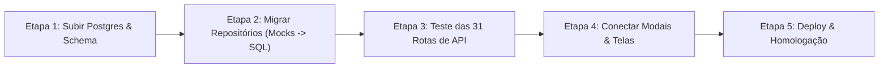

# Mapeamento Completo: Frontend, Backend (31 Rotas API), Repositórios & Schema PostgreSQL
**Açaí da Rose — Arquitetura de Produção de Ponta a Ponta & Roteiro de Desacoplamento de Mocks**

---

## 1. Visão Geral do Ecossistema

Este documento consolida o mapeamento 360° de todo o sistema:
* **Frontend**: 4 Telas/Rotas e 25+ Modais/Diálogos.
* **Backend**: 31 Endpoints de API REST (`app/api/**/route.ts`).
* **Camada de Repositórios**: 7 Repositórios de Dados (`lib/repositories/`).
* **Banco de Dados**: 19 Tabelas Relacionais no PostgreSQL 16 com RLS Multi-Tenant.

```mermaid
flowchart TD
    subgraph "1. Frontend (Next.js 15 App Router)"
        UI_PDV["💻 PDV Balcão & Mesas"]
        UI_QR["📱 Cardápio QR Code Mobile"]
        UI_TV["📺 Smart TV de Chamadas"]
        UI_ADMIN["🏢 Painel Franqueadora & TI"]
    end

    subgraph "2. Backend API (31 Endpoints REST)"
        API_AUTH["/api/auth/* (3)"]
        API_ORDERS["/api/orders/* (4)"]
        API_PRODUCTS["/api/products/* (5)"]
        API_TABLES["/api/tables/* (3)"]
        API_CASHIER["/api/cashier/* (1)"]
        API_FRANCHISE["/api/franchise/* (2)"]
        API_PAYMENTS["/api/payments/* & webhooks (2)"]
        API_OTHERS["/api/users, staff, reports, ratings, waiter (11)"]
    end

    subgraph "3. Camada de Repositórios (lib/repositories/)"
        R_PROD["productsRepository.ts"]
        R_ORD["ordersRepository.ts"]
        R_TAB["tablesRepository.ts"]
        R_TEN["tenantsRepository.ts"]
        R_CASH["cashierRepository.ts"]
        R_USR["usersRepository.ts"]
        R_STF["staffRepository.ts"]
    end

    subgraph "4. PostgreSQL 16 (19 Tabelas na VPS 198.50.117.110)"
        DB_TENANTS["tenants, users, audit_logs"]
        DB_CATALOG["product_containers, product_bases, product_toppings, store_price_overrides"]
        DB_SALES["restaurant_tables, orders, cashier_shifts, cashier_movements, waiter_calls"]
        DB_EXPANSION["store_stories, store_devices, inventory_items, store_inventory, supply_orders, inventory_audits"]
    end

    UI_PDV & UI_QR & UI_TV & UI_ADMIN --> API_AUTH & API_ORDERS & API_PRODUCTS & API_TABLES & API_CASHIER & API_FRANCHISE & API_PAYMENTS & API_OTHERS
    API_AUTH & API_ORDERS & API_PRODUCTS & API_TABLES & API_CASHIER & API_FRANCHISE & API_PAYMENTS & API_OTHERS --> R_PROD & R_ORD & R_TAB & R_TEN & R_CASH & R_USR & R_STF
    R_PROD & R_ORD & R_TAB & R_TEN & R_CASH & R_USR & R_STF --> DB_TENANTS & DB_CATALOG & DB_SALES & DB_EXPANSION
```



---

## 2. Inventário de Todas as 31 Rotas de API Backend (`app/api/`)

| # | Rota da API | Métodos | Finalidade no Sistema | Tabela Postgres Destino |
| :-: | :--- | :---: | :--- | :--- |
| **1** | `/api/auth/login` | `POST` | Autenticação de utilizadores (Email + Senha) e emissão de sessão/JWT. | `users` |
| **2** | `/api/auth/logout` | `POST` | Encerramento de sessão e invalidação de cookie. | - |
| **3** | `/api/auth/me` | `GET` | Retorna o perfil, role e tenant do utilizador autenticado. | `users`, `tenants` |
| **4** | `/api/orders` | `GET`, `POST` | Listagem de pedidos da loja e criação de novo pedido (PDV/Mesa). | `orders` |
| **5** | `/api/orders/[id]` | `GET`, `PATCH` | Detalhes do pedido e atualização de status no KDS (`PREPARING`, `READY`). | `orders` |
| **6** | `/api/orders/[id]/cancel` | `POST` | Cancelamento de pedido com registro de motivo e operador. | `orders`, `audit_logs` |
| **7** | `/api/orders/search` | `GET` | Busca de pedidos por cliente, número ou data. | `orders` |
| **8** | `/api/products` | `GET`, `POST` | Consulta do catálogo e criação de novos produtos. | `product_containers`, `bases`, `toppings` |
| **9** | `/api/products/[category]` | `GET` | Consulta filtrada por categoria (`containers`, `bases`, `toppings`). | Tabelas de catálogo |
| **10** | `/api/products/[category]/[id]` | `PUT`, `DELETE` | Edição e exclusão lógica de produto do catálogo. | Tabelas de catálogo |
| **11** | `/api/products/toggle-availability`| `POST` | Ativa/Desativa insumo especificamente na loja do franqueado. | `store_product_overrides` |
| **12** | `/api/products/sync-all` | `POST` | Replicação e publicação de preços para toda a rede ou filiais. | `product_containers`, `store_price_overrides` |
| **13** | `/api/tables` | `GET`, `POST` | Listagem de mesas da loja e abertura de nova mesa. | `restaurant_tables` |
| **14** | `/api/tables/[id]` | `GET`, `PATCH`, `DELETE` | Atualização de status da mesa, inclusão de itens e encerramento. | `restaurant_tables`, `orders` |
| **15** | `/api/tables/transfer` | `POST` | Transferência de comanda entre mesas do salão. | `restaurant_tables` |
| **16** | `/api/cashier/operations` | `GET`, `POST` | Abertura/fechamento de turno, suprimento e sangria de caixa. | `cashier_shifts`, `cashier_movements` |
| **17** | `/api/call-waiter` | `GET`, `POST`, `PATCH` | Envio de chamado de garçom da mesa e atendimento pelo staff. | `waiter_calls` |
| **18** | `/api/tenants` | `GET`, `POST` | Listagem e criação de franquias/unidades da rede. | `tenants` |
| **19** | `/api/tenants/[id]` | `GET`, `PUT`, `DELETE` | Edição dos dados cadastrais e fiscais da filial. | `tenants` |
| **20** | `/api/tenants/[id]/settings` | `GET`, `PATCH` | Configurações de MB WAY, NIF e percentual de royalties. | `tenants` |
| **21** | `/api/users` | `GET`, `POST` | Listagem e cadastro de funcionários/gerentes da loja. | `users` |
| **22** | `/api/users/[id]` | `GET`, `PUT`, `DELETE` | Atualização de perfil, permissão e redefinição de senha. | `users` |
| **23** | `/api/staff` | `GET`, `POST` | Gestão de garçons e operadores de salão. | `staff` |
| **24** | `/api/staff/[id]` | `PUT`, `DELETE` | Edição de dados do colaborador. | `staff` |
| **25** | `/api/reports/day` | `GET` | Relatório consolidado de vendas do dia, ticket médio e mix de produtos. | `orders`, `cashier_shifts` |
| **26** | `/api/ratings` | `GET`, `POST` | Envio e relatório de notas NPS de clientes. | `customer_ratings` |
| **27** | `/api/qrcode-config` | `GET`, `POST` | Configurações visuais e links para geração de QR Code de mesa. | `tenants` |
| **28** | `/api/franchise/overview` | `GET` | Dashboard corporativo da Franqueadora com faturamento da rede. | `orders`, `tenants` |
| **29** | `/api/franchise-requests` | `GET`, `POST`, `PATCH`| Solicitações de alteração de preço enviadas por franqueados. | `franchise_requests` |
| **30** | `/api/payments/ifthenpay/mbway` | `POST` | Disparo de cobrança mobile via MB WAY para o telemóvel do cliente. | `orders` |
| **31** | `/api/webhooks/ifthenpay` | `POST` | Webhook assíncrono de confirmação de pagamento MB WAY. | `orders` (muda para `PAID`) |

---

## 3. Mapeamento dos 7 Repositórios de Dados (`lib/repositories/`)

| Repositório | Métodos Implementados | Transição de Mock ➡️ PostgreSQL de Produção |
| :--- | :--- | :--- |
| [`productsRepository.ts`](file:///c:/Users/Henrique%20-%20PC/Desktop/Projetos%20Dev/acaidarose/lib/repositories/productsRepository.ts) | `getCatalogByTenant`, `createProduct`, `updateProduct`, `deleteProduct`, `toggleProductAvailability`, `setStoreProductPrice`, `syncAllStoresPrices` | Substituir `getMockStore()` por consultas SQL com `LEFT JOIN store_price_overrides` e `store_product_overrides`. |
| [`ordersRepository.ts`](file:///c:/Users/Henrique%20-%20PC/Desktop/Projetos%20Dev/acaidarose/lib/repositories/ordersRepository.ts) | `createOrder`, `getOrdersByTenant`, `getOrderById`, `updateOrderStatus`, `cancelOrder`, `searchOrders`, `getDayReportSummary` | `INSERT INTO orders` atômico com cálculo de `order_number` sequencial diário por loja. |
| [`tablesRepository.ts`](file:///c:/Users/Henrique%20-%20PC/Desktop/Projetos%20Dev/acaidarose/lib/repositories/tablesRepository.ts) | `getTablesByTenant`, `updateTableStatus`, `addItemsToTable`, `closeTableOrder`, `transferTable`, `createTable`, `deleteTable` | Operações diretas na tabela `restaurant_tables` com `JSONB` de itens ativos. |
| [`tenantsRepository.ts`](file:///c:/Users/Henrique%20-%20PC/Desktop/Projetos%20Dev/acaidarose/lib/repositories/tenantsRepository.ts) | `getAllTenants`, `getTenantById`, `getTenantBySlug`, `createTenant`, `updateTenant`, `deleteTenant`, `updateTenantSettings` | `SELECT / INSERT / UPDATE` na tabela `tenants`. |
| [`cashierRepository.ts`](file:///c:/Users/Henrique%20-%20PC/Desktop/Projetos%20Dev/acaidarose/lib/repositories/cashierRepository.ts) | `openShift`, `closeShift`, `getCurrentShift`, `addCashMovement`, `getShiftReport` | Gravação dos turnos em `cashier_shifts` e movimentações em `cashier_movements`. |
| [`usersRepository.ts`](file:///c:/Users/Henrique%20-%20PC/Desktop/Projetos%20Dev/acaidarose/lib/repositories/usersRepository.ts) | `getUsersByTenant`, `getUserById`, `getUserByEmail`, `createUser`, `updateUser`, `deleteUser`, `validatePassword` | Consulta de credenciais em `users` com validação de senha via `bcrypt`. |
| [`staffRepository.ts`](file:///c:/Users/Henrique%20-%20PC/Desktop/Projetos%20Dev/acaidarose/lib/repositories/staffRepository.ts) | `getStaffByTenant`, `createStaff`, `updateStaff`, `deleteStaff` | `SELECT / INSERT / UPDATE` na tabela `staff`. |

---

## 4. DDL Consolidado do Banco de Dados (19 Tabelas no PostgreSQL 16)

```sql
-- =====================================================================
-- AÇAÍ DA ROSE — SCHEMA COMPLETO DE PRODUÇÃO (PostgreSQL 16)
-- =====================================================================
CREATE EXTENSION IF NOT EXISTS "uuid-ossp";
CREATE EXTENSION IF NOT EXISTS "pgcrypto";

-- 1. LOJAS / FRANQUIAS (Tenants)
CREATE TABLE IF NOT EXISTS tenants (
    id UUID PRIMARY KEY DEFAULT uuid_generate_v4(),
    name VARCHAR(255) NOT NULL,
    slug VARCHAR(100) UNIQUE NOT NULL,
    nif VARCHAR(50),
    address TEXT,
    phone VARCHAR(50),
    mbway_phone VARCHAR(50),
    currency VARCHAR(10) DEFAULT 'EUR',
    royalty_percentage NUMERIC(5, 2) DEFAULT 5.00,
    is_headquarters BOOLEAN DEFAULT FALSE,
    active BOOLEAN DEFAULT TRUE,
    created_at TIMESTAMP WITH TIME ZONE DEFAULT timezone('utc'::text, now()) NOT NULL,
    updated_at TIMESTAMP WITH TIME ZONE DEFAULT timezone('utc'::text, now()) NOT NULL,
    deleted_at TIMESTAMP WITH TIME ZONE
);

-- 2. UTILIZADORES & ACESSOS
CREATE TABLE IF NOT EXISTS users (
    id UUID PRIMARY KEY DEFAULT uuid_generate_v4(),
    tenant_id UUID REFERENCES tenants(id) ON DELETE SET NULL,
    email VARCHAR(255) UNIQUE NOT NULL,
    name VARCHAR(255) NOT NULL,
    password_hash TEXT NOT NULL,
    role VARCHAR(50) DEFAULT 'CASHIER' NOT NULL, -- 'SUPER_ADMIN', 'TENANT_ADMIN', 'CASHIER'
    active BOOLEAN DEFAULT TRUE,
    created_at TIMESTAMP WITH TIME ZONE DEFAULT timezone('utc'::text, now()) NOT NULL,
    updated_at TIMESTAMP WITH TIME ZONE DEFAULT timezone('utc'::text, now()) NOT NULL,
    deleted_at TIMESTAMP WITH TIME ZONE
);

-- 3. CATÁLOGO: RECIPIENTES (Copos / Taças / Barcas)
CREATE TABLE IF NOT EXISTS product_containers (
    id UUID PRIMARY KEY DEFAULT uuid_generate_v4(),
    tenant_id UUID REFERENCES tenants(id) ON DELETE CASCADE,
    name VARCHAR(100) NOT NULL,
    weight_grams INTEGER DEFAULT 500,
    preco_base NUMERIC(10, 2) NOT NULL DEFAULT 0.00,
    limite_bases INTEGER NOT NULL DEFAULT 1,
    limite_complementos_gratis INTEGER NOT NULL DEFAULT 0,
    emoji VARCHAR(50) DEFAULT '🍨',
    image_url TEXT,
    video_url TEXT,
    display_order INTEGER DEFAULT 0,
    active BOOLEAN DEFAULT TRUE,
    created_at TIMESTAMP WITH TIME ZONE DEFAULT timezone('utc'::text, now()) NOT NULL,
    updated_at TIMESTAMP WITH TIME ZONE DEFAULT timezone('utc'::text, now()) NOT NULL,
    deleted_at TIMESTAMP WITH TIME ZONE
);

-- 4. CATÁLOGO: BASES E SORBETS
CREATE TABLE IF NOT EXISTS product_bases (
    id UUID PRIMARY KEY DEFAULT uuid_generate_v4(),
    tenant_id UUID REFERENCES tenants(id) ON DELETE CASCADE,
    name VARCHAR(100) NOT NULL,
    description TEXT,
    image_url TEXT,
    display_order INTEGER DEFAULT 0,
    active BOOLEAN DEFAULT TRUE,
    created_at TIMESTAMP WITH TIME ZONE DEFAULT timezone('utc'::text, now()) NOT NULL,
    updated_at TIMESTAMP WITH TIME ZONE DEFAULT timezone('utc'::text, now()) NOT NULL,
    deleted_at TIMESTAMP WITH TIME ZONE
);

-- 5. CATÁLOGO: TOPPINGS & ACOMPANHAMENTOS
CREATE TABLE IF NOT EXISTS product_toppings (
    id UUID PRIMARY KEY DEFAULT uuid_generate_v4(),
    tenant_id UUID REFERENCES tenants(id) ON DELETE CASCADE,
    name VARCHAR(100) NOT NULL,
    category VARCHAR(50) NOT NULL, -- 'Frutas', 'Cereais', 'Doces', 'Premium'
    is_premium BOOLEAN DEFAULT FALSE,
    preco_extra NUMERIC(10, 2) NOT NULL DEFAULT 0.00,
    emoji VARCHAR(50) DEFAULT '✨',
    image_url TEXT,
    display_order INTEGER DEFAULT 0,
    active BOOLEAN DEFAULT TRUE,
    created_at TIMESTAMP WITH TIME ZONE DEFAULT timezone('utc'::text, now()) NOT NULL,
    updated_at TIMESTAMP WITH TIME ZONE DEFAULT timezone('utc'::text, now()) NOT NULL,
    deleted_at TIMESTAMP WITH TIME ZONE
);

-- 6. OVERRIDES DE PREÇOS POR LOJA
CREATE TABLE IF NOT EXISTS store_price_overrides (
    id UUID PRIMARY KEY DEFAULT uuid_generate_v4(),
    tenant_id UUID NOT NULL REFERENCES tenants(id) ON DELETE CASCADE,
    product_id VARCHAR(100) NOT NULL,
    custom_price NUMERIC(10, 2) NOT NULL,
    updated_at TIMESTAMP WITH TIME ZONE DEFAULT timezone('utc'::text, now()) NOT NULL,
    UNIQUE(tenant_id, product_id)
);

-- 7. OVERRIDES DE DISPONIBILIDADE POR LOJA
CREATE TABLE IF NOT EXISTS store_product_overrides (
    id UUID PRIMARY KEY DEFAULT uuid_generate_v4(),
    tenant_id UUID NOT NULL REFERENCES tenants(id) ON DELETE CASCADE,
    product_id VARCHAR(100) NOT NULL,
    is_available BOOLEAN NOT NULL DEFAULT TRUE,
    updated_at TIMESTAMP WITH TIME ZONE DEFAULT timezone('utc'::text, now()) NOT NULL,
    UNIQUE(tenant_id, product_id)
);

-- 8. MESAS & SALÃO
CREATE TABLE IF NOT EXISTS restaurant_tables (
    id UUID PRIMARY KEY DEFAULT uuid_generate_v4(),
    tenant_id UUID NOT NULL REFERENCES tenants(id) ON DELETE CASCADE,
    table_number INTEGER NOT NULL,
    status VARCHAR(50) DEFAULT 'FREE' NOT NULL, -- 'FREE', 'OCCUPIED', 'BILL_REQUESTED'
    customer_name VARCHAR(255),
    opened_at TIMESTAMP WITH TIME ZONE,
    current_bill_total NUMERIC(10, 2) DEFAULT 0.00,
    items_json JSONB DEFAULT '[]'::jsonb,
    created_at TIMESTAMP WITH TIME ZONE DEFAULT timezone('utc'::text, now()) NOT NULL,
    UNIQUE(tenant_id, table_number)
);

-- 9. PEDIDOS & COMANDAS (Orders)
CREATE TABLE IF NOT EXISTS orders (
    id UUID PRIMARY KEY DEFAULT uuid_generate_v4(),
    tenant_id UUID NOT NULL REFERENCES tenants(id) ON DELETE CASCADE,
    cashier_id UUID REFERENCES users(id) ON DELETE SET NULL,
    cashier_name VARCHAR(255),
    customer_name VARCHAR(255),
    customer_phone VARCHAR(50),
    customer_nif VARCHAR(50),
    order_number INTEGER NOT NULL,
    subtotal NUMERIC(10, 2) NOT NULL DEFAULT 0.00,
    total NUMERIC(10, 2) NOT NULL DEFAULT 0.00,
    status VARCHAR(50) DEFAULT 'PAID' NOT NULL, -- 'PAID', 'PREPARING', 'READY', 'COMPLETED', 'CANCELLED'
    payment_method VARCHAR(50) NOT NULL, -- 'MBWAY', 'NUMERARIO', 'TPA_MULTIBANCO', 'CARTAO'
    payment_reference TEXT,
    is_table_order BOOLEAN DEFAULT FALSE,
    table_number INTEGER,
    cancelled_at TIMESTAMP WITH TIME ZONE,
    cancel_reason TEXT,
    cancelled_by_name VARCHAR(255),
    items_json JSONB NOT NULL DEFAULT '[]'::jsonb,
    created_at TIMESTAMP WITH TIME ZONE DEFAULT timezone('utc'::text, now()) NOT NULL
);

-- 10. TURNOS DE CAIXA (Cashier Shifts)
CREATE TABLE IF NOT EXISTS cashier_shifts (
    id UUID PRIMARY KEY DEFAULT uuid_generate_v4(),
    tenant_id UUID NOT NULL REFERENCES tenants(id) ON DELETE CASCADE,
    operator_id UUID NOT NULL REFERENCES users(id),
    operator_name VARCHAR(255) NOT NULL,
    opening_balance NUMERIC(10, 2) NOT NULL DEFAULT 0.00,
    closing_balance NUMERIC(10, 2),
    total_sales_cash NUMERIC(10, 2) DEFAULT 0.00,
    total_sales_mbway NUMERIC(10, 2) DEFAULT 0.00,
    total_sales_tpa NUMERIC(10, 2) DEFAULT 0.00,
    status VARCHAR(50) DEFAULT 'OPEN' NOT NULL, -- 'OPEN', 'CLOSED'
    opened_at TIMESTAMP WITH TIME ZONE DEFAULT timezone('utc'::text, now()) NOT NULL,
    closed_at TIMESTAMP WITH TIME ZONE,
    notes TEXT
);

-- 11. MOVIMENTAÇÕES DE CAIXA (Suprimentos / Sangrias)
CREATE TABLE IF NOT EXISTS cashier_movements (
    id UUID PRIMARY KEY DEFAULT uuid_generate_v4(),
    shift_id UUID NOT NULL REFERENCES cashier_shifts(id) ON DELETE CASCADE,
    tenant_id UUID NOT NULL REFERENCES tenants(id) ON DELETE CASCADE,
    type VARCHAR(50) NOT NULL, -- 'SUPRIMENTO', 'SANGRIA'
    amount NUMERIC(10, 2) NOT NULL,
    reason TEXT NOT NULL,
    created_at TIMESTAMP WITH TIME ZONE DEFAULT timezone('utc'::text, now()) NOT NULL
);

-- 12. CHAMADOS DE GARÇOM (Waiter Calls)
CREATE TABLE IF NOT EXISTS waiter_calls (
    id UUID PRIMARY KEY DEFAULT uuid_generate_v4(),
    tenant_id UUID NOT NULL REFERENCES tenants(id) ON DELETE CASCADE,
    table_number INTEGER NOT NULL,
    reason VARCHAR(100) NOT NULL, -- 'AGUA', 'TALHERES', 'CONTA', 'DUVIDA'
    status VARCHAR(50) DEFAULT 'PENDING' NOT NULL, -- 'PENDING', 'ATTENDED'
    created_at TIMESTAMP WITH TIME ZONE DEFAULT timezone('utc'::text, now()) NOT NULL,
    attended_at TIMESTAMP WITH TIME ZONE
);

-- 13. LOGS DE AUDITORIA
CREATE TABLE IF NOT EXISTS audit_logs (
    id UUID PRIMARY KEY DEFAULT uuid_generate_v4(),
    tenant_id UUID REFERENCES tenants(id) ON DELETE CASCADE,
    user_id UUID REFERENCES users(id) ON DELETE SET NULL,
    action VARCHAR(100) NOT NULL,
    entity VARCHAR(100) NOT NULL,
    entity_id VARCHAR(100),
    metadata JSONB DEFAULT '{}'::jsonb,
    created_at TIMESTAMP WITH TIME ZONE DEFAULT timezone('utc'::text, now()) NOT NULL
);

-- 14. CARDÁPIO EM VÍDEO & STORIES (Mídias)
CREATE TABLE IF NOT EXISTS store_stories (
    id UUID PRIMARY KEY DEFAULT uuid_generate_v4(),
    tenant_id UUID REFERENCES tenants(id) ON DELETE CASCADE,
    title VARCHAR(100) NOT NULL,
    video_url TEXT NOT NULL,
    thumbnail_url TEXT NOT NULL,
    linked_product_id UUID,
    badge_text VARCHAR(50),
    display_order INTEGER DEFAULT 0,
    active BOOLEAN DEFAULT TRUE,
    created_at TIMESTAMP WITH TIME ZONE DEFAULT timezone('utc'::text, now()) NOT NULL
);

-- 15. DISPOSITIVOS HOMOLOGADOS (Tokens de TVs e Totens)
CREATE TABLE IF NOT EXISTS store_devices (
    id UUID PRIMARY KEY DEFAULT uuid_generate_v4(),
    tenant_id UUID NOT NULL REFERENCES tenants(id) ON DELETE CASCADE,
    device_name VARCHAR(100) NOT NULL,
    device_type VARCHAR(50) NOT NULL, -- 'TV_DISPLAY', 'TABLET_TABLE', 'KIOSK_TOTEM', 'KDS_SCREEN'
    device_token VARCHAR(255) UNIQUE NOT NULL,
    is_active BOOLEAN DEFAULT TRUE,
    created_at TIMESTAMP WITH TIME ZONE DEFAULT timezone('utc'::text, now()) NOT NULL
);

-- 16. INSUMOS DA REDE & TABELA DE MERCADO
CREATE TABLE IF NOT EXISTS inventory_items (
    id UUID PRIMARY KEY DEFAULT uuid_generate_v4(),
    name VARCHAR(150) NOT NULL,
    unit VARCHAR(20) NOT NULL, -- 'UN', 'KG', 'L', 'CX'
    category VARCHAR(50) NOT NULL, -- 'BASE', 'TOPPING', 'EMBALAGEM'
    market_benchmark_price NUMERIC(10, 2) NOT NULL DEFAULT 0.00,
    franchise_supply_price NUMERIC(10, 2) NOT NULL DEFAULT 0.00,
    is_critical_checklist BOOLEAN DEFAULT FALSE,
    created_at TIMESTAMP WITH TIME ZONE DEFAULT timezone('utc'::text, now()) NOT NULL
);

-- 17. SALDO DE ESTOQUE POR LOJA
CREATE TABLE IF NOT EXISTS store_inventory (
    id UUID PRIMARY KEY DEFAULT uuid_generate_v4(),
    tenant_id UUID NOT NULL REFERENCES tenants(id) ON DELETE CASCADE,
    item_id UUID NOT NULL REFERENCES inventory_items(id) ON DELETE CASCADE,
    current_quantity NUMERIC(10, 2) NOT NULL DEFAULT 0.00,
    min_alert_quantity NUMERIC(10, 2) NOT NULL DEFAULT 0.00,
    last_counted_at TIMESTAMP WITH TIME ZONE,
    updated_at TIMESTAMP WITH TIME ZONE DEFAULT timezone('utc'::text, now()) NOT NULL,
    UNIQUE (tenant_id, item_id)
);

-- 18. PEDIDOS DE ABASTECIMENTO B2B (Filiais -> Matriz Aveiro)
CREATE TABLE IF NOT EXISTS supply_orders (
    id UUID PRIMARY KEY DEFAULT uuid_generate_v4(),
    tenant_id UUID NOT NULL REFERENCES tenants(id) ON DELETE CASCADE,
    order_number SERIAL,
    status VARCHAR(50) DEFAULT 'PENDING' NOT NULL,
    total_amount NUMERIC(10, 2) NOT NULL DEFAULT 0.00,
    total_savings NUMERIC(10, 2) NOT NULL DEFAULT 0.00,
    items_json JSONB NOT NULL DEFAULT '[]'::jsonb,
    created_at TIMESTAMP WITH TIME ZONE DEFAULT timezone('utc'::text, now()) NOT NULL
);

-- 19. AUDITORIA DE QUEBRAS E FECHO DE CAIXA
CREATE TABLE IF NOT EXISTS inventory_audits (
    id UUID PRIMARY KEY DEFAULT uuid_generate_v4(),
    tenant_id UUID NOT NULL REFERENCES tenants(id) ON DELETE CASCADE,
    cashier_shift_id UUID REFERENCES cashier_shifts(id),
    item_id UUID NOT NULL REFERENCES inventory_items(id) ON DELETE CASCADE,
    theoretical_quantity NUMERIC(10, 2) NOT NULL,
    counted_quantity NUMERIC(10, 2) NOT NULL,
    difference NUMERIC(10, 2) NOT NULL,
    reason VARCHAR(100),
    operator_id UUID REFERENCES users(id),
    created_at TIMESTAMP WITH TIME ZONE DEFAULT timezone('utc'::text, now()) NOT NULL
);

-- 20. AVALIAÇÕES NPS DE CLIENTES
CREATE TABLE IF NOT EXISTS customer_ratings (
    id UUID PRIMARY KEY DEFAULT uuid_generate_v4(),
    tenant_id UUID NOT NULL REFERENCES tenants(id) ON DELETE CASCADE,
    order_id UUID REFERENCES orders(id) ON DELETE SET NULL,
    score INTEGER NOT NULL CHECK (score >= 1 AND score <= 5),
    comment TEXT,
    created_at TIMESTAMP WITH TIME ZONE DEFAULT timezone('utc'::text, now()) NOT NULL
);

-- 21. SOLICITAÇÕES DE FILIAIS (Preços & Alterações)
CREATE TABLE IF NOT EXISTS franchise_requests (
    id UUID PRIMARY KEY DEFAULT uuid_generate_v4(),
    tenant_id UUID NOT NULL REFERENCES tenants(id) ON DELETE CASCADE,
    product_id VARCHAR(100) NOT NULL,
    product_name VARCHAR(150) NOT NULL,
    requested_price NUMERIC(10, 2) NOT NULL,
    current_price NUMERIC(10, 2) NOT NULL,
    reason TEXT NOT NULL,
    status VARCHAR(50) DEFAULT 'PENDING' NOT NULL,
    reviewed_by UUID REFERENCES users(id),
    reviewed_at TIMESTAMP WITH TIME ZONE,
    created_at TIMESTAMP WITH TIME ZONE DEFAULT timezone('utc'::text, now()) NOT NULL
);

-- =====================================================================
-- ÍNDICES DE PERFORMANCE
-- =====================================================================
CREATE INDEX IF NOT EXISTS idx_orders_tenant_date ON orders(tenant_id, created_at);
CREATE INDEX IF NOT EXISTS idx_orders_status ON orders(status);
CREATE INDEX IF NOT EXISTS idx_tables_tenant ON restaurant_tables(tenant_id, status);
CREATE INDEX IF NOT EXISTS idx_containers_tenant ON product_containers(tenant_id);
CREATE INDEX IF NOT EXISTS idx_users_tenant ON users(tenant_id);
CREATE INDEX IF NOT EXISTS idx_devices_token ON store_devices(device_token);
```

---

## 5. Roteiro de Execução de Engenharia da Migração



1. **Etapa 1 — Provisionamento do Banco PostgreSQL na VPS (`198.50.117.110`)**:
   - Subir container PostgreSQL 16 com volume persistente no NVMe.
   - Executar o DDL das 19 tabelas e carregar o seed das lojas (Torres Novas e Aveiro).
2. **Etapa 2 — Refatoração dos 7 Repositórios de Dados**:
   - Eliminar `mockStore.ts` e converter métodos para consultas SQL reais no PostgreSQL.
3. **Etapa 3 — Teste das 31 Rotas de API Backend**:
   - Validar endpoints de autenticação, catálogo, pedidos, mesas, caixa e pagamentos.
4. **Etapa 4 — Validação dos Modais & Telas Frontend**:
   - Garantir que todos os 25+ modais gravam e leem do banco de produção.
5. **Etapa 5 — Build de Produção, Deploy & Homologação**:
   - Build do Next.js 15 Standalone e apontamento do domínio oficial `https://acaidarose.pt`.
