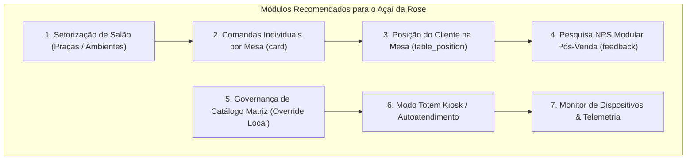

# Plano de Evolução Estratégica & Comparativo Arquitetural
**Açaí da Rose vs. OiMenu / Abrahão: O que Adotar, Otimizar e Descartar**

---

## 1. Visão Geral Executiva

O sistema **OiMenu (Abrahão)** é uma referência nacional no mercado de **food service** para autoatendimento via QR Code, tablets de mesa, totens e gestão de franquias. Analisando a engenharia do banco de dados (`oimenu_bkp.sql`), identificamos **padrões de negócio consolidados** e recursos que agregam alto valor ao **Açaí da Rose**, além de práticas obsoletas que devemos modernizar.

O **Açaí da Rose** já possui uma arquitetura tecnologicamente superior (Next.js 15, TypeScript, Tailwind CSS, Zustand, Supabase e UI reativa). Ao incorporar os melhores recursos do OiMenu com essa base moderna, o projeto atinge um patamar de **produto enterprise de classe mundial**.

---

## 2. Comparativo Estrutural Direto

| Dimensão | OiMenu / Abrahão (Legado MySQL/Sequelize) | Açaí da Rose (Moderno Next.js 15 + Supabase) | Veredito & Oportunidade |
| :--- | :--- | :--- | :--- |
| **Arquitetura & Sincronismo** | Polling periódico em tabelas (`store_update`, `outdated`). | Reatividade em tempo real (Zustand + Supabase Realtime). | **Superior no Açaí da Rose** (zero overhead de banco). |
| **Estrutura Multiloja** | `store` com token fixo e queries com `oimenu_id`. | Multi-tenant desacoplado por `tenantId` / `storeId`. | **Superior no Açaí da Rose** (Franqueadora vs Franqueados). |
| **Divisão de Salão / Setores** | Tabela `square` (*1º Andar*, *Piscina*, *Esplanada*). | Apenas lista plana de mesas numeradas. | ⭐ **Adotar do OiMenu**: Criar Praças/Setores físicos. |
| **Comandas por Mesa** | Tabela `card` (múltiplas comandas por mesa). | Pedido unificado por mesa (`RestaurantTable.items`). | ⭐ **Adotar do OiMenu**: Suporte a comandas individuais. |
| **Posição na Mesa** | `table_position` (Cadeira 1, 2, 3...). | Sem rastreamento de assento. | ⭐ **Adotar do OiMenu**: Identificar cadeira no QR Code. |
| **Chamados de Garçom** | Motivos rápidos (`call_waiter_option`) por setor. | `CallWaiterModal.tsx` com motivos de 1 toque. | ✅ **Já implementado** (Adicionar vínculo com praça). |
| **Pesquisa NPS / Avaliação** | Tabela `feedback` com notas modulares por área. | Sem pesquisa pós-atendimento. | ⭐ **Adotar do OiMenu**: NPS pós-pagamento no QR Code. |
| **Controle de Catálogo Franqueadora** | `is_invisible_by_matriz_first_load`. | Catálogo global por loja. | ⭐ **Adotar do OiMenu**: Flag de ativação local de produto. |
| **Totem / Autoatendimento** | `kiosk_order_mode`, `is_kiosk_enabled`. | Cardápio web responsivo. | ⭐ **Adotar do OiMenu**: Modo Kiosk/Totem em tela cheia. |
| **Telemetria de Dispositivos** | `battery_level`, `wifi_status`, `app_version`. | Sem telemetria de hardware. | ⭐ **Adotar do OiMenu**: Monitor de KDS e Tablets no Admin. |

---

## 3. O "Ouro" do OiMenu: Recursos Ideais para o Açaí da Rose

Abaixo estão os **7 módulos de alto impacto** identificados no OiMenu que trarão salto de maturidade e diferencial competitivo para o Açaí da Rose:



---

### Módulo 1: Setorização de Salão & Praças Físicas (`Square / Area`)
* **Problema Resolvido**: Em lojas com vários ambientes (ex: *Esplanada*, *Salão Térreo*, *Piso Superior*, *Take-away*), o salão de mesas fica desorganizado e os garçons perdem tempo.
* **Como Implementar**:
  - Adicionar campo `squareId` ou `area` (`'ESPLANADA'`, `'SALAO'`, `'PISO_1'`) no modelo `RestaurantTable`.
  - Abas/Filtros visuais no [TablesHallView.tsx](file:///c:/Users/Henrique%20-%20PC/Desktop/Projetos%20Dev/acaidarose/components/pdv/TablesHallView.tsx).
  - Roteamento de impressão térmica direcionado para a impressora mais próxima da praça.

---

### Módulo 2: Comandas Individuais & Divisão de Conta por Mesa (`Card / Sub-Comandas`)
* **Problema Resolvido**: Grupos de amigos sentam na mesma mesa (Mesa 04) e cada um pede pelo seu celular, querendo pagar apenas o seu açaí.
* **Como Implementar**:
  - No cardápio QR Code (`/cardapio/mesa/[tableId]`), o cliente informa seu nome ou número de comanda individual (ex: *Mesa 04 - Henrique*, *Mesa 04 - Maria*).
  - No checkout do PDV ([TableCheckoutDetail.tsx](file:///c:/Users/Henrique%20-%20PC/Desktop/Projetos%20Dev/acaidarose/components/pdv/TableCheckoutDetail.tsx)), o caixa pode:
    1. Cobrar a mesa inteira de uma vez.
    2. Cobrar individualmente por pessoa/comanda, liberando o cliente que vai embora mais cedo.

---

### Módulo 3: Posição do Cliente na Mesa (`Table Position / Assento`)
* **Problema Resolvido**: Em mesas grandes, o garçom traz a comanda pronta e precisa perguntar *"De quem é o açaí com morango e leite ninho?"*.
* **Como Implementar**:
  - Campo opcional no carrinho QR Code: *"Qual o seu assento / posição? (ex: Cadeira 1, 2...)"*.
  - O ticket térmico e a comanda do KDS exibem em destaque: `Mesa 08 - Assento 03`.

---

### Módulo 4: Pesquisa NPS Modular Pós-Venda (`Feedback System`)
* **Problema Resolvido**: Falta de dados analíticos sobre a experiência do cliente nas lojas franqueadas.
* **Como Implementar**:
  - Assim que o pagamento é concluído no QR Code (ou após fechar a conta no PDV com envio de recibo por WhatsApp/SMS), exibe modal amigável com 5 estrelas:
    - ⭐ Avaliação Geral (1 a 5 estrelas).
    - Chips rápidos de feedback: *Velocidade*, *Qualidade do Açaí*, *Ambiente*, *Atendimento*, *Música*.
    - Campo de observação aberta.
  - Painel analítico no Admin da Franqueadora para ranquear as melhores lojas da rede.

---

### Módulo 5: Governança Franquia - Override Local de Catálogo (`is_invisible_by_matriz`)
* **Problema Resolvido**: A franqueadora lança um novo sabor ou edição limitada (ex: *Açaí com Pistache e Trufa Belga*), mas uma filial específica ficou sem estoque do insumo ou precisa desativar temporariamente.
* **Como Implementar**:
  - O catálogo canônico é gerido pela Franqueadora (Sede Torres Novas).
  - Cada loja franqueada tem uma tabela de sobrescrita local: `store_product_override` (`storeId`, `productId`, `isAvailable`, `customPrice`).
  - O franqueado não pode alterar nome, descrição ou foto oficial, garantindo o padrão da franquia, mas pode pausar o item se faltar estoque na loja.

---

### Módulo 6: Modo Totem Autoatendimento / Kiosk (`Kiosk Mode`)
* **Problema Resolvido**: Filiais de alto fluxo (shoppings, estações, centros urbanos) precisam de totens de autoatendimento para reduzir filas no balcão.
* **Como Implementar**:
  - Rota dedicada: `/totem` ou `/kiosk`.
  - Interface em tela cheia com botões grandes, fotos em alta resolução, fluxo guiado passo a passo e reset por inatividade (timeout de 60 segundos).
  - Pagamento direto via MBWay / QR Code PIX na tela ou integração com maquininha TEF/SmartPOS.

---

### Módulo 7: Telemetria de Dispositivos e KDS (`Device Telemetry`)
* **Problema Resolvido**: O tablet da cozinha ou o KDS fica sem bateria ou perde o Wi-Fi e a loja para de receber pedidos sem que o gerente perceba.
* **Como Implementar**:
  - Pequeno heartbeat enviado a cada 60s pelo tablet/KDS com: nível de bateria (`battery_level`), status online/offline e versão do app.
  - Painel de status no Admin: indicador verde/vermelho para cada terminal ativo.

---

## 4. O que Descartar do OiMenu (Dívida Técnica & Padrões Ultrapassados)

Para manter o Açaí da Rose leve, rápido e com alta manutenibilidade, **NÃO** devemos replicar as falhas estruturais do OiMenu:

1. ❌ **Tabelas de Polling Infinito (`store_update`)**: O OiMenu cria tabelas para avisar o que mudou. No Açaí da Rose usamos Zustand + eventos em tempo real / WebSockets, muito mais rápidos e sem escrita desnecessária em disco.
2. ❌ **Múltiplas Tabelas de Impressão Fragmentadas (`deliway_impression`, `deliway_item_impression`, `impression`)**: Estrutura redundante e rígida. No Açaí da Rose, padronizamos um payload JSON limpo para o serviço de impressão térmica.
3. ❌ **Drivers Nativos Pesados**: O OiMenu depende de executáveis Windows pesados (`OiMenuApi`). O Açaí da Rose opera como PWA web moderna com bridge leve para impressão USB/Rede ESC-POS.

---

## 5. Roadmap de Implementação em 4 Fases

```
[Fase 1: Salão & Atendimento de Alto Padrão]
  ├── Setorização de Mesas por Praça (Esplanada, Salão, Varanda)
  ├── Comandas e Clientes Individuais por Mesa
  └── Indicação de Cadeira / Posição na Mesa no QR Code

[Fase 2: Experiência do Cliente & Franquia]
  ├── Pesquisa de Satisfação NPS Pós-Pagamento
  └── Governança de Catálogo (Override de Disponibilidade por Loja)

[Fase 3: Autoatendimento & Totens]
  ├── Rota Kiosk / Totem de Autoatendimento em Tela Cheia
  └── Reset automático por inatividade e fluxo guiado

[Fase 4: Telemetria & Monitoramento de Operações]
  └── Heartbeat de dispositivos (KDS, PDV, Tablets) no Painel Admin
```

---

## 6. Conclusão

A absorção dos conceitos maduros do OiMenu/Abrahão combinada com a agilidade e elegância da stack atual do **Açaí da Rose** posiciona o sistema como uma solução **completa, robusta para franquias e preparada para escala nacional e internacional**.
