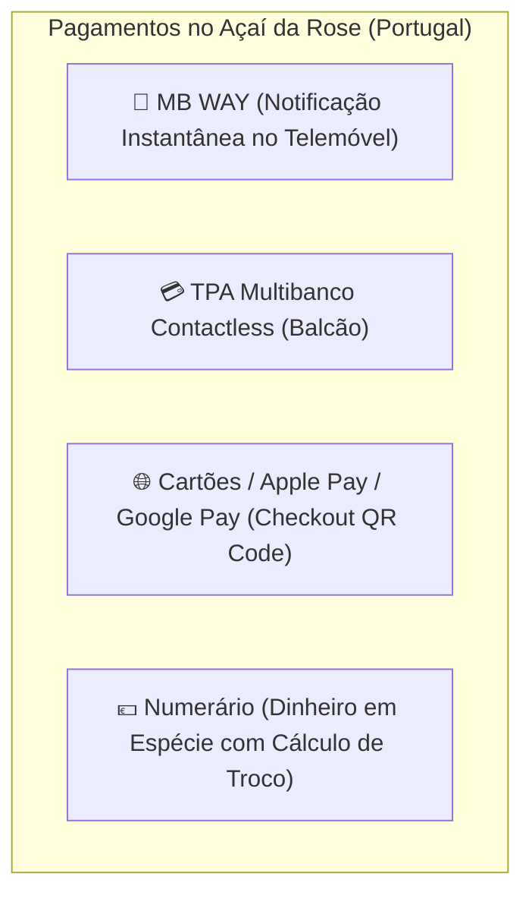
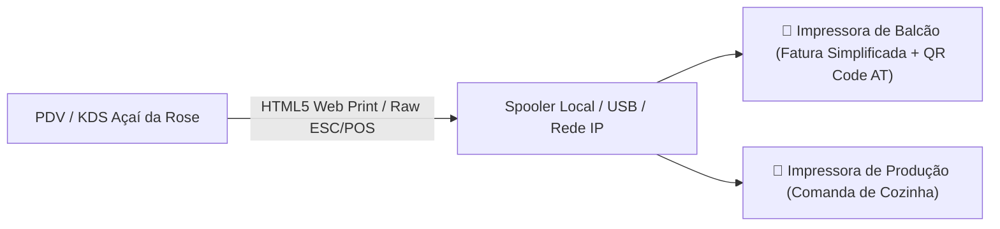

# Especificação Técnica: Sistema Fiscal (AT) & Meios de Pagamento em Portugal
**Açaí da Rose — Arquitetura de Faturamento Certificado (ATCUD/SAF-T) e Gateway Multi-Loja (MB WAY/TPA)**

---

## 1. Legislação Fiscal em Portugal (Autoridade Tributária - AT)

Em Portugal, a emissão de documentos fiscais de venda ao público (Faturas Simplificadas e Faturas-Recibo) é rigorosamente regulada pela **Autoridade Tributária e Aduaneira (AT)** sob as regras da Portaria n.º 363/2010 e subsequentes.

### Exigências Legais Obrigatórias:
1. **Assinatura Digital com Chave RSA**: Todo documento emitido gera uma chave/hash criptográfica irreversível baseada no documento anterior.
2. **Código ATCUD**: Código único de identificação do documento validado com as séries comunicadas à AT.
3. **QR Code Fiscal**: Impresso no rodapé de todo talão fiscal segundo o padrão de leitura da AT.
4. **Ficheiro SAF-T (PT)**: Ficheiro XML padronizado mensal exportado para a contabilidade de cada franquia.

---

## 2. Arquitetura de Integração Fiscal Híbrida

Para garantir **100% de conformidade legal** sem os altos custos e burocracias de homologar um software do zero na AT, o **Açaí da Rose** atua como o sistema de frente de loja (PDV, QR Code, KDS, Gestão) e comunica via **API REST com um motor fiscal certificado em Portugal** (*Moloni*, *Vendus* ou *InvoiceXpress*).

```mermaid
flowchart LR
    PDV["💻 PDV Açaí da Rose (Balcão / QR Code)"] -->|1. Venda Paga (Itens + NIF + IVA)| FiscalAPI["⚙️ API Fiscal Certificada AT (Moloni / Vendus)"]
    FiscalAPI -->|2. Retorna ATCUD + Hash + QR Code Fiscal| ThermalPrint["🧾 Impressão de Fatura Simplificada"]
    FiscalAPI -->|3. Exportação Mensal Automática| SAFT["📊 Ficheiro SAF-T (PT) para o Contabilista"]
```

### Regras de Tributação (IVA):
* **Alimentação & Consumo Imediato (Açaí, Toppings)**: **13% (Taxa Intermédia de IVA)** em Portugal Continental.
* **Bebidas / Refrigerantes / Cervejas**: **23% (Taxa Normal de IVA)**.
* **Take-away não preparado (se aplicável)**: **6% (Taxa Reduzida de IVA)**.
* **Identificação do Consumidor**:
  - Com NIF informado pelo cliente.
  - Sem NIF: Fatura emitida automaticamente como *Consumidor Final* (`NIF: 999999990`).

---

## 3. Ecossistema de Meios de Pagamento em Portugal



### Detalhamento por Canal de Venda:

| Método | Canal de Uso | Provedor / Gateway | Taxas / Condições Típicas em PT |
| :--- | :--- | :--- | :--- |
| **MB WAY** | PDV Balcão e QR Code Mesa | **Ifthenpay**, **Eupago** ou **SIBS** | ~0.7% a 1.0% por transação. O cliente aprova em 2s no telemóvel. |
| **TPA Multibanco** | Balcão da Loja | **Viva Wallet**, **SIBS / Reduniq**, **myPOS** ou **SumUp** | Débito nacional (~0.4% a 0.8%) e Contactless. |
| **Apple Pay / Cartão Online** | QR Code na Mesa | **Stripe** ou **Viva Wallet** | Permite ao cliente pagar na mesa sem chamar o garçom. |
| **Numerário (€)** | Balcão da Loja | Registro nativo no PDV | Controle de fundo de caixa e sangrias. |

---

## 4. Multi-Tenant: Independência Financeira das Franquias

* **Subcontas por Unidade**:
  - Cada loja (Torres Novas, Aveiro, Franquias) cadastra suas próprias chaves de API:
    - `at_tax_api_key`: Para emitir faturas no NIF da respectiva empresa da loja.
    - `mbway_merchant_key`: Para o dinheiro das vendas cair diretamente na conta bancária do franqueado.
* **Painel Consolidado da Franqueadora**:
  - A Matriz acompanha o faturamento bruto em tempo real para cálculo automático dos Royalties e Fundo de Propaganda da rede.

---

## 5. Impressão Térmica de Faturas & Comandas (Padrão ESC/POS)

Para a operação física das lojas, o sistema suporta comunicação direta com impressoras térmicas padrão de mercado (Epson, Xprinter, Bematech, Star Micronics) em bobinas de **80mm** e **58mm**:



* **Impressão de Balcão**: Emite a Fatura Simplificada com cabeçalho da loja, número do pedido, detalhamento de bases/toppings, resumo de IVA (13%/23%), código ATCUD e o QR Code fiscal da AT no rodapé.
* **Impressão de Cozinha (KDS Fallback)**: Ticket resumido com letras ampliadas destacando tamanho do copo e personalizações para o operador de montagem.

---

## 6. Conformidade com o RGPD (Regulamento Geral de Proteção de Dados - UE)

Para operar em conformidade rigorosa com a legislação da União Europeia em Portugal:
1. **Minimização de Dados**: Coleta-se apenas dados estritamente necessários para a transação fiscal (NIF para fatura) ou entrega (telefone/nome para identificação no balcão).
2. **Consentimento Explícito no QR Code**: Termo de privacidade acessível no rodapé do cardápio mobile informando o processamento de dados do pedido.
3. **Anonimização & Retenção**: Dados de contato de clientes no histórico de pedidos são anonimizados após o período fiscal obrigatório.
