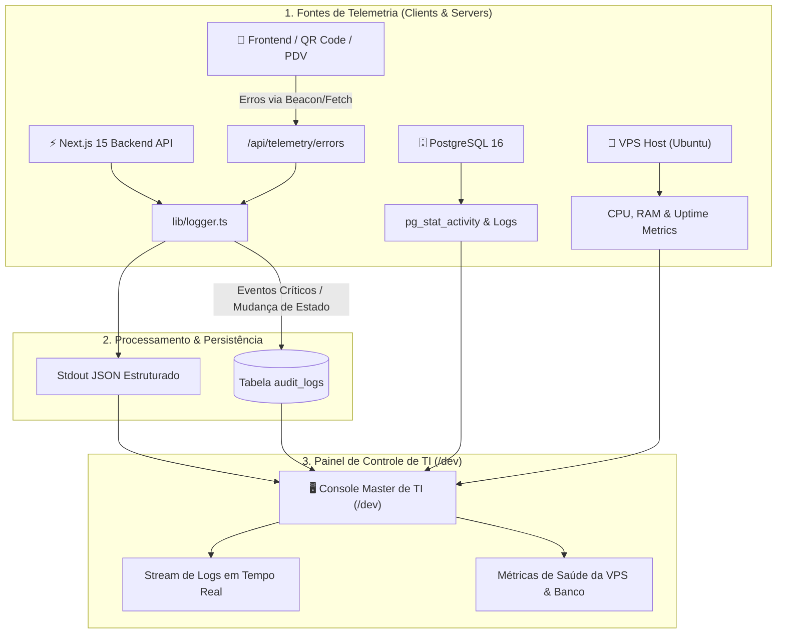

# Especificação Técnica: Sistema de Logger Estruturado & Monitoramento de TI
**Açaí da Rose — Telemetria de Produção, Rastreamento de Erros e Observabilidade 360°**

---

## 1. Visão Geral da Observabilidade

Para assegurar total visibilidade operacional ao TI/Desenvolvedor, o sistema conta com uma infraestrutura unificada de **Logger Estruturado** e **Telemetria em Tempo Real** cobrindo Frontend, Backend e Infraestrutura da VPS.



---

## 2. Níveis de Log e Padrão Estruturado (`lib/logger.ts`)

Todos os logs seguem o formato padronizado JSON com carimbo de data/hora ISO e metadados contextuais:

| Nível (`level`) | Quando é Utilizado | Destino / Tratamento |
| :--- | :--- | :--- |
| **`debug`** | Diagnóstico técnico em ambiente de desenvolvimento (payloads, estados internos). | Exibido apenas com `NODE_ENV !== 'production'`. |
| **`info`** | Operações normais do ciclo de vida (início de turno, login com sucesso, pedido criado). | Console estruturado / stdout. |
| **`warn`** | Comportamentos inesperados não fatais (tempo de resposta elevado, fallback de rede). | Console com destaque amarelo. |
| **`error`** | Exceções, falhas de gateway MB WAY, erros de SQL ou crash no navegador do cliente. | Console com stack trace + envio automático para `/api/telemetry/errors`. |
| **`audit`** | Ações administrativas e financeiras críticas (desativar loja, fecho de caixa, exclusões). | Gravado de forma atômica na tabela `audit_logs`. |

---

## 3. Estrutura do Payload de Log Estruturado

```json
{
  "timestamp": "2026-08-28T01:45:00.123Z",
  "level": "error",
  "message": "Falha na confirmação de pagamento MB WAY",
  "context": {
    "tenantId": "11111111-1111-1111-1111-111111111111",
    "tenantSlug": "aveiro",
    "userId": "usr_9988a1",
    "action": "PAYMENT_MBWAY_CALLBACK",
    "endpoint": "/api/payments/ifthenpay/mbway",
    "durationMs": 1420,
    "orderNumber": 104
  },
  "error": {
    "name": "GatewayTimeoutError",
    "message": "Ifthenpay API response timed out after 10000ms",
    "stack": "Error: GatewayTimeoutError at ifthenpayService.ts:45..."
  }
}
```

---

## 4. Telemetria do Frontend (Client Error Capture)

Para capturar erros que ocorrem no telemóvel do cliente (ex: incompatibilidade de navegador ou falha de WebGL):
1. **Interceptação Global**: `window.onerror` e `window.onunhandledrejection` capturam exceções não tratadas no React;
2. **Envio Não-Bloqueante (`navigator.sendBeacon`)**: O erro é despachado para `/api/telemetry/errors` em segundo plano, sem degradar a experiência visual nem bloquear a montagem do açaí.

---

## 5. Painel de Monitoramento de TI na Central Master (`/dev`)

O painel `/dev` exibe uma aba dedicada à **Telemetria em Tempo Real**:

```
+-------------------------------------------------------------------------+
| TELEMETRIA & SAUDE DO SISTEMA                             Status: 🟢 OK |
+-------------------------------------------------------------------------+
| METRICAS DO SERVIDOR VPS (198.50.117.110):                              |
|   CPU Load: 4.2% (4 vCPUs)        RAM: 1.4 GB / 6.0 GB (23% em uso)     |
|   Disco NVMe: 14.8 GB / 100 GB    Uptime: 18 dias, 4 horas              |
|   Fuso Horario: Europe/Lisbon     Swap: 40 MB / 2048 MB                 |
+-------------------------------------------------------------------------+
| METRICAS DO POSTGRESQL 16:                                              |
|   Conexoes Ativas: 6 / 100        Tamanho do Banco: 42 MB               |
|   Latencia Media de Query: 1.8ms  Ultimo Backup: Hoje as 03:00 AM (OK)  |
+-------------------------------------------------------------------------+
| LIVE ERROR STREAM (Ultimos Eventos da Rede):                            |
|   [20:44:12] [INFO]  Pedido #102 criado com sucesso (Torres Novas)      |
|   [20:45:01] [AUDIT] Caixa Fechado por Gerente Carlos (Aveiro)          |
|   [20:46:18] [WARN]  Tempo de resposta MB WAY elevado: 1850ms           |
+-------------------------------------------------------------------------+
```

---

## 6. Alertas Críticos Automáticos

O sistema dispara avisos de alta prioridade no console de TI nos seguintes cenários:
* **Taxa de Erro em Pagamentos**: > 3 falhas consecutivas no gateway MB WAY;
* **Uso de Memória RAM na VPS**: > 85% de ocupação;
* **Conexões no PostgreSQL**: > 80 conexões simultâneas ativas;
* **Atraso na Execução de Backups**: Ausência de dump nas últimas 26 horas.
