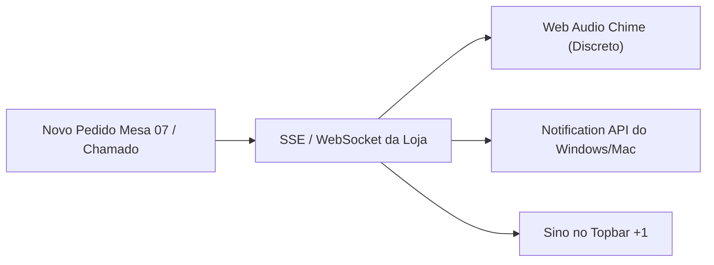

# Sistema de Notificações no PC (Desktop Web Push & Alertas Sonoros)
**Açaí da Rose — Arquitetura de Notificações em Tempo Real, Áudio Chime e Web Push**

---

## 1. Visão Geral do Sistema

Em ambientes de restaurante e balcão movimentado, os operadores muitas vezes alternam de aba no navegador ou realizam tarefas enquanto aguardam pedidos. Para garantir que **nenhum pedido da mesa e nenhum chamado de garçom passe despercebido**, o sistema implementa um **sistema duplo de notificação**:

1. **Notificações Nativas do Sistema Operacional (Windows / macOS / Linux)**: Popups nativos no canto inferior/superior do ecrã mesmo com o navegador minimizado.
2. **Alertas Sonoros Discretos (Audio Chimes)**: Toque acústico suave gerado via **Web Audio API** (sem necessidade de arquivos de áudio pesados).
3. **Painel de Histórico no Topbar**: Sino com contador em tempo real e lista de últimos avisos da unidade.



---

## 2. Eventos que Disparam Notificações no PC

| Evento | Notificação no PC (Título & Mensagem) | Som de Alerta | Perfil Destino |
| :--- | :--- | :---: | :--- |
| **Novo Pedido QR Code na Mesa** | 🔔 **Novo Pedido — Mesa 04**<br>*Taça 500g + 3 Toppings (Total: 8,50€)* | *Chime Duplo* | Caixa, Cozinha (KDS) |
| **Chamado de Empregado de Mesa** | 🙋 **Chamado — Mesa 08**<br>*Cliente solicitou a conta / atendimento* | *Chime Suave* | Caixa, Staff de Salão |
| **Pagamento MB WAY Aprovado** | 💳 **Pagamento Recebido**<br>*Pedido #104 pago via MB WAY (9,00€)* | *Chime Caixa* | Operador de Caixa |
| **Nova Solicitação de Preço** | 📝 **Solicitação de Cardápio**<br>*Filial Torres Novas enviou proposta de preço* | *Silencioso* | Franqueadora (Aveiro) |
| **Alerta de Estoque Crítico** | ⚠️ **Estoque Mínimo Atingido**<br>*Leite Ninho atingiu o saldo de alerta (2 kg)* | *Chime Alerta* | Gerente da Loja |

---

## 3. Implementação Técnica

### A. Solicitação de Permissão & Disparo Desktop (Navegador)
```typescript
// lib/notifications/desktopNotification.ts
export async function requestDesktopNotificationPermission(): Promise<boolean> {
  if (!('Notification' in window)) return false

  if (Notification.permission === 'granted') return true
  if (Notification.permission !== 'denied') {
    const permission = await Notification.requestPermission()
    return permission === 'granted'
  }
  return false
}

export function sendDesktopNotification(title: string, options?: NotificationOptions) {
  if (typeof window !== 'undefined' && 'Notification' in window && Notification.permission === 'granted') {
    const notif = new Notification(title, {
      icon: '/logo.png',
      badge: '/badge.png',
      silent: true, // O som é gerenciado pelo Web Audio API
      ...options,
    })

    notif.onclick = () => {
      window.focus()
      notif.close()
    }
  }
}
```

---

### B. Sintetizador de Áudio Nativo (Web Audio API — Zero Mídia Externa)
```typescript
// lib/notifications/soundChime.ts
export function playChimeSound(type: 'ORDER' | 'WAITER' | 'ALERT' = 'ORDER') {
  if (typeof window === 'undefined') return
  try {
    const AudioContext = window.AudioContext || (window as any).webkitAudioContext
    if (!AudioContext) return
    const ctx = new AudioContext()

    const osc = ctx.createOscillator()
    const gain = ctx.createGain()

    osc.connect(gain)
    gain.connect(ctx.destination)

    const now = ctx.currentTime

    if (type === 'ORDER') {
      // Tom harmônico e positivo (587Hz -> 880Hz)
      osc.type = 'sine'
      osc.frequency.setValueAtTime(587.33, now) // D5
      osc.frequency.exponentialRampToValueAtTime(880, now + 0.15) // A5
      gain.gain.setValueAtTime(0.3, now)
      gain.gain.exponentialRampToValueAtTime(0.001, now + 0.4)
      osc.start(now)
      osc.stop(now + 0.4)
    } else if (type === 'WAITER') {
      // Tom suave de sino (784Hz)
      osc.type = 'triangle'
      osc.frequency.setValueAtTime(783.99, now) // G5
      gain.gain.setValueAtTime(0.25, now)
      gain.gain.exponentialRampToValueAtTime(0.001, now + 0.5)
      osc.start(now)
      osc.stop(now + 0.5)
    }
  } catch {
    // Ignora se o navegador restringir áudio antes do primeiro clique
  }
}
```

---

## 4. Configuração de Som e Alertas no Painel

No menu do operador, haverá um painel de controle rápido:
* `[x] Ativar Notificações no Ambiente de Trabalho (Windows/Mac)`
* `[x] Tocar Alerta Sonoro ao Entrar Novo Pedido`
* `[x] Tocar Alerta Sonoro em Chamados de Mesa`
* **Slider de Volume**: 0% a 100% com botão de *Testar Som*.
